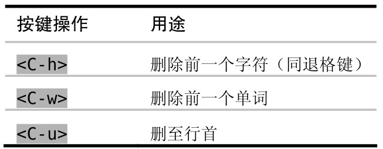

如果在插入模式下撰写文本时出了错，我们可以立刻对它进行更正，而无需切换模式。要迅速更正错误，除了用退格键外，我们还可以用插入模式中的其他一些命令。

这些命令不是插入模式所独有的，甚至也不是 Vim 所独有的，在 Vim 的命令行模式中，以及在 bash shell 中，也可以使用它们。

另外，你也可以切换到普通模式，然后跳到这个词的开头并更正错误，再按 A 返回刚才的位置。不过完成这一套动作要花的时间可能不止 1 秒钟，并且它也无助于提高你的盲打技巧。虽然说我们可以切换模式，不过这并不意味着一定就得切换。
