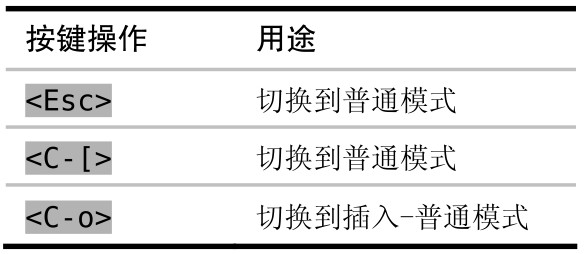

插入模式只专注于做一件事，那就是输入文字，而普通模式却是我们大部分时间所使用的模式（顾名思义），因此能快速在这两种模式间切换是很重要的。本节将介绍一些技巧，可以减少模式切换所带来的损耗。

切换回普通模式的经典方式是使用 `<Esc>` 键，但在许多键盘上这个键的距离似乎有点远。作为替代，我们也可以用 `<C-[>` ，它的效果与 `<Esc>` 完全相同。

Vim 新手经常会被不断地切换模式而搞得疲倦不堪，不过练习过一段时间以后，就会渐渐感觉到得心应手了。不过，Vim 区分模式的特点在下面这种特定场景中却显得有点烦琐：当我们处于插入模式时，想运行一个普通模式命令，然后马上回到原来的位置继续输入。Vim 为此提供了一种巧妙的方法，以减少模式切换所带来的不畅，这就是插入-普通模式。

插入-普通模式是普通模式的一个特例，在此模式中，我们可以执行一个普通模式命令，执行完后，马上就又返回到插入模式。要从插入模式切换到插入 - 普通模式，可以按 `<C-o>`

在当前行正好处于窗口顶部或底部时，有时我会滚动一下屏幕，以便看到更多的上下文。用 `zz` 命令可以重绘屏幕，并把当前行显示在窗口正中，这样就能够阅读当前行之上及之下的半屏内容。我常常会键入 `<C-o>zz`，在插入 - 普通模式中触发这条命令。此操作完成后就会直接回到插入模式，因此我可以不受中断地继续打字。
