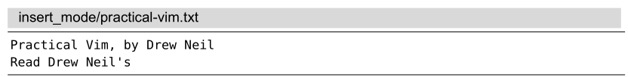
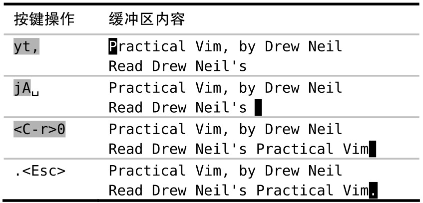

Vim 的复制和粘贴操作一般都在普通模式中执行，不过有时我们也许想不离开插入模式，就能往文档里粘贴文本。

下面是一段尚未完成的文本：

我们想把本书的书名插到最后一行，以补全该行。由于书名在第一行的开头已经出现过了，我们将把它复制到一个寄存器中，然后在插入模式中把它添加到第二行结尾。

`yt`, 命令把“Practical Vim”复制到复制专用寄存器中，然后我们在插入模式中，按 `<C-r>0` 把刚才复制的文本粘贴到光标所在位置

这个命令一般的格式是 `<C-r>{register}`，其中`{register}`是我们想要插入的寄存器的名字

在插入模式中，可以用`<C-r>{register}` 命令很方便地粘贴几个单词。可是如果寄存器中包含了大量的文本，你也许会发现屏幕的更新有些轻微的延时。这是因为 Vim 在插入寄存器内的文本时，其插入方式就如同这些文本是由键盘上一个个输进来的。因此，如果‘textwidth’或者‘autoindent’选项被激活了的话，那么最终就可能会出现不必要的换行或额外的缩进。

`<C-r><C-p>{register}` 命令则会更智能一些，它会按原义插入寄存器内的文本，并修正任何不必要的缩进，不过这个命令有点不太好输入！因此，如果我想从一个寄存器里粘贴很多行文本的话，我更喜欢切换到普通模式，然后使用某个粘贴命令
