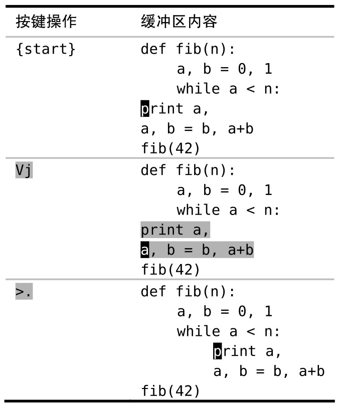

当使用 `.` 命令重复对高亮选区所做的修改时，此修改会重复作用于相同范围的文本。在本节中，我们会对一个面向行的高亮选区做一个修改，然后使用 `.` 命令重复此修改。

可视模式中执行完一条命令后，我们就会返回到普通模式，并且在可视模式里所选中的文本范围也不再高亮显示了。那么，如果我们想对相同范围的文本执行另外一条可视模式命令，该怎么办？

假设有一段 Python 代码的缩进有些问题，如下所示：

```
def fib(n):
  a, b = 0, 1
  while a < n:
print a,
a, b = b, a+b
fib(42)
```

## 缩进一次，然后重复

在这段缩进错误的 Python 代码中，while 关键字下面的两行应该多缩进两级。我们可以高亮选择这两行，然后用 `>` 命令对它进行缩进，以修正其缩进错误。但此操作只增加一级缩进就返回普通模式了。

要解决此问题，一个办法是使用 `gv` 命令重选相同的文本，然后再次调用缩进命令。然而，如果你已经对 Vim 解决问题的方式有所领悟的话，你脑海里应该会响起警钟。

当需要执行重复操作时，`.` 命令是最佳的解决方案。与其手动重选相同范围的文本并执行相同的命令，倒不如直接在普通模式里按 `.` 键。下面是具体的操作：



如果你善于计算的话，也许更乐意在可视模式中执行 `2>` 以便一步到位。不过我更喜欢用 `.` 命令，因为它可以给我即时的视觉反馈。如果我需要再次缩进的话，只需再按一次 `.` 键即可；或者如果我按的次数太多了，导致缩进过深，按 `u` 键就可以撤销多余的缩进。

在使用 `.` 命令重复一条可视模式命令时，它所操作的文本数量和上次被高亮选中的文本数量相同。对于面向行的高亮选区来说，这种做法往往符合我们的需要。但对于面向字符的高亮选区来说，这却会产生令人意外的结果。接下来我们将通过一个例子来说明这一点。
