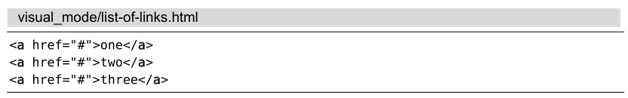
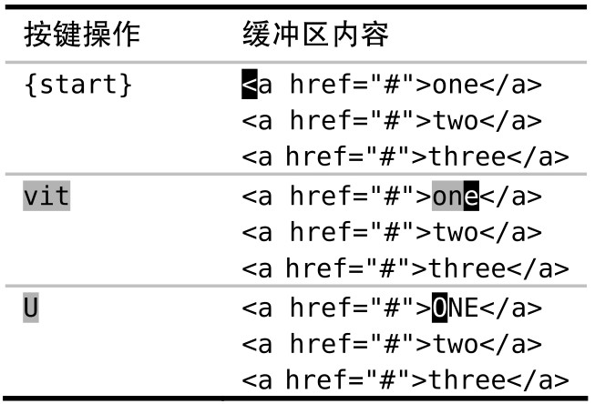
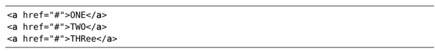
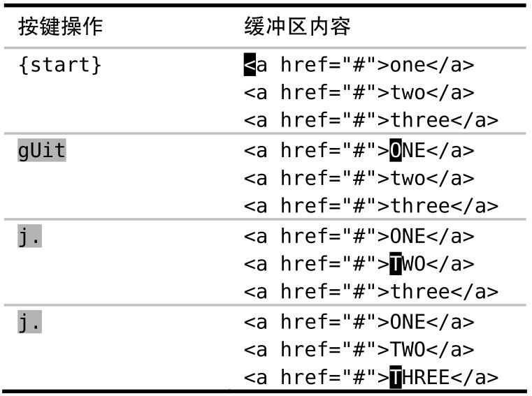

可视模式可能比 Vim 的普通模式操作起来更自然一些，但是它有一个缺点：在这个模式下 `.` 命令有时会有一些异常的表现。我们可以用普通模式下的操作符命令来规避此缺点。

假设我们想把下面列表中的链接文字转换为大写格式：

我们可以用 `vit` 来选择标签里的内容。`vit` 可被解读为高亮选中标签内部的内容（visually select inside the tag），其中，`it` 命令是一种被称为文本对象（text object）的特殊动作命令

## 使用可视模式下的命令

在可视模式中，我们可以选定一个选区然后对其进行操作。本例中，我们可以使用 `U` 命令来把所选中的字符转换为大写

在转换完第一行后，现在我们想对接下来的两行进行同样的修改。用点范式试一下吧，怎么样？

好，我们执行一下 `j.` 命令，把光标移到下一行并重复上次的修改。此命令在第二行工作得很好，但如果我们再执行一次，最终就会得到这个看起来有点古怪的结果：

你看到发生什么了吗？当一条可视模式命令被重复执行时，它会影响相同数量的文本。在本例中，最初的命令影响了一个由 3 个字母组成的单词。在第二行它依旧工作得很好，因为该行恰好也包含一个由 3 个字母组成的单词。但是，当我们想对一个由 5 个字母组成的单词重复此命令时，它只成功转换了其中的前 3 个字母，留下 2 个字母未被转换。

## 使用普通模式下的操作符命令

可视模式下的 `U` 命令有一个等效的普通模式命令：`gU{motion}`。如果我们用此命令做第一处修改，就可以用点范式完成后续的修改

## 结论

这两种方式都只需要 4 次按键操作：`vitU` 及 `gUit`，但其背后的含义却大相径庭。在可视模式所采用的方式里，这 4 次按键可以被当做两个独立的命令。`vit` 用来选中选区，而 `U` 用来对选区进行转换。与之相反的是，`gUit` 命令可以被当成一个单独的命令，它由一个操作符（`gU`）和一个动作命令（`it`）组成。

注：本人在 `VSCode` 中使用 `Vim` 插件无法复现这个 bug，可以正常转换为大写，但在命令行确实复现了，应该是 `VSCode` 的 `Vim` 插件修复了这个 bug
