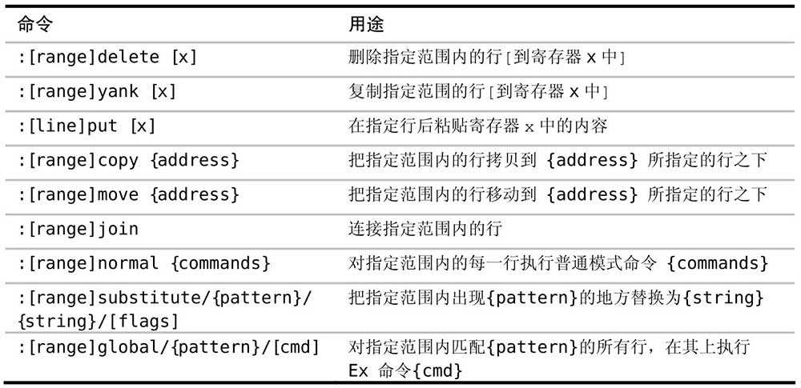

初时，先有 ed，ed 为 ex 之父，ex 为 vi 之父，而 vi 为 Vim 之父。

Vim 的先祖是 vi，正是 vi 开创了区分模式编辑的范例。相应的，vi 奉一个名为 ex 的行编辑器为先祖，这就是为什么会有 Ex 命令。这些早期 Unix 文本编辑器的血脉依旧流淌在现代 Vim 中，对某些基于行的编辑任务来说，Ex 命令仍然是最佳工具。在本章中，我们将学习如何使用命令行模式，这将为我们揭示 ex 编辑器的余风遗韵。

命令行模式会提示我们输入一条 Ex 命令、一个查找模式，或一个表达式。在本节，我们将结识一些操作缓冲区中的文本的 Ex 命令，并学习一些可在此模式中使用的特殊按键映射项。

在按下 `:` 键时，Vim 会切换到命令行模式。这个模式和 shell 下的命令行有些类似，我们可以输入一条命令，然后按 `<CR>` 执行它。在任意时刻，我们都可以按 `<Esc>` 键从命令行模式切换回普通模式。

出于历史原因，在命令行模式中执行的命令又被称做 Ex 命令，参见 Vim（及其家族）的词源。在我们按 `/` 调出查找提示符时，命令行模式也会被激活。本节介绍的一些技巧在这些不同的提示符下都适用，不过本节内容主要侧重在 Ex 命令上。

我们可以用 Ex 命令读写文件（`:edit` 和 `:write`），创建新标签页（`:tabnew`）及分割窗口（`:split`），或是操作参数列表（`:prev/:next`）及缓冲区列表（`:bprev/:bnext`）。事实上，Vim 为几乎所有功能都提供了相应的 Ex 命令

本节中，我们主要关注那些用来编辑文本的 Ex 命令（参见`:h ex-cmd-index` 可获得完整列表）

在这些命令中，绝大部分都可指定所操作的范围，我们将在下一个技巧中了解这意味着什么。

在命令行模式中，键盘上的大部分按键都只是简单输入一个字符，这点与插入模式类似。只不过在插入模式中，文本被输入到缓冲区里，而在命令行模式中，文本出现在命令行上。另外，在这两种模式中都可以用组合键触发命令。

有些命令在插入模式和命令行模式中可以通用。例如，可以用 `<C-w>` 和 `<C-u>` 分别删除至上个单词的开头及行首，也可以用 `<C-r>{register}` 命令把任意寄存器的内容插入到命令行

有时使用 Ex 命令，能比用普通模式命令更快地完成同样的工作。举个例子，普通模式命令一般操作当前字符或当前行，而 Ex 命令却可以在任意位置执行，这意味着我们无需移动光标就可以使用 Ex 命令做出修改。但使 Ex 命令脱颖而出的最让人赞叹的功能，是它们拥有能够在多行上同时执行的能力。

一般地说，Ex 命令操作范围更大，并且能够在一次执行中修改多行；或者可以进一步精炼为 Ex 命令影响范围广且距离远。

Vim（及其家族）的词源

ed 是最初的 Unix 文本编辑器，它编写于图形显示器很稀有的年代，那时源代码通常是打印在纸带上，并在电传终端机上进行编辑。在终端上输入的命令被送到大型机上进行处理，每条命令的输出会被打印出来。在那个年代，从终端到大型机之间的连接很慢，以至于一个快速打字员比网络还快，他们输入命令的速度要比命令被发出去处理更快。在这种情况下，ed 能够提供一个简洁的语法变得异常重要（这里的意思是说，命令发出去的速度很慢，所以需要用简短的文本来表示命令）。想一下为何 p 被用来打印当前行，而 %p 被用来打印整个文件，皆缘于此。

ed 历经了几代的改进，包括 em（意为“editor for mortals”，即“人类的编辑器”）、en，最终到 ex。此时图形显示器已经比较普及了，ex 增加了一个把终端屏幕设置成交互窗口的功能，并在窗口内显示文件的内容。这样，在做修改时实时看到变化成为了可能。此屏幕编辑模式由 :visual 命令激活，其简写为 :vi，这即是 vi 这个名字的由来。

Vim 代表改进版的 vi（vi improved），然而这只是一种谦虚的说法，我实在无法忍受使用标准的 vi。通过查阅 `:h vi-differences`，我们可以看到 Vim 支持而 vi 不支持的功能列表。Vim 对功能的增强是必要的，但另一方面它却仍继承了大量的遗产。这些指导 Vim 先祖们设计的约束，给我们提供了一个非常高效的命令集，这在今天依然很有价值。
