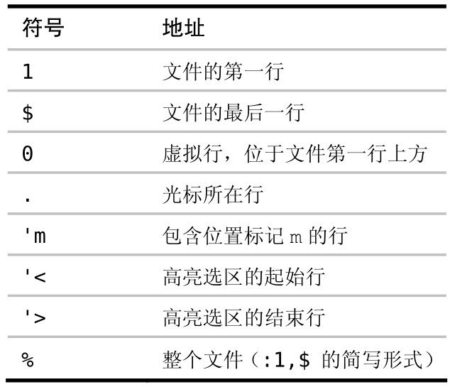

很多 Ex 命令可以用 `[range]` 指定要操作的范围。我们可以用行号、位置标记或是查找模式来指定范围的开始位置及结束位置。

Ex 命令的优点之一是它们可以在某一范围内的所有行上执行。我们以下面这个简短的 HTML 文本作为示例：

```
<!DOCTYPE html>
<html>
  <head><title>Practical Vim</title></head>
  <body><h1>Practical Vim</h1></body>
</html>
```

我们将使用 `:print` 命令作为演示。这条命令只是简单地在 Vim 命令行下方回显指定行的内容，它不产生什么实际影响，不过可以用它来说明一个范围由哪些行构成。当然，你可以试着把以下示例中的 `:print` 换成诸如 `:delete`、`:join`、`:substitute` 或 `:normal` 这样的命令，这样就能真切地感受到 Ex 命令是多么有用。

## 用行号作为地址

如果输入一条只包含数字的 Ex 命令，那么 Vim 会把这个数字解析成一个地址，并把光标移动到该数字所指定的行上。例如，运行下面的命令将跳到文件的首行：

➾:1

再运行下面的命令将打印首行的字符

➾:print

`《 <!DOCTYPE html>`

此文件只包含 5 行内容，如果要跳到文件的末尾，既可以输入 `:5`，也可以用特殊符号 `$`：

➾:$

➾:p

`《 </html>`

我们在这里使用的是 `:p`，它是 `:print` 命令的简写。实际上，用不着分开执行这两条命令，可以像下面这样把这两条命令合成一条：

➾:3p

`《 <head><title>Practical Vim</title></head>`

此命令会把光标移到第 3 行，然后显示该行的内容。记住，这里用 `:p` 命令的目的只是为了进行讲解。如果你执行的是 `:3d` 命令，那么只需一条命令就可以跳到第 3 行并删除此行；而与之等效的普通模式命令，则要先执行 `3G`，再跟着执行 `dd`。因此，从这个例子就可以看出，Ex 命令执行得要比普通模式命令更快。

## 用地址指定一个范围

迄今为止，地址只是被当成一个单独的行号，不过我们也可以用它来指定一个范围，如下例所示：

➾:2,5p

```
《 <html>
  <head><title>Practical Vim</title></head>
  <body><h1>Practical Vim</h1></body>
</html>
```

此例会打印从第 2 行到第 5 行之间的每一行的内容（含第 2 行及第 5 行）。注意，运行完这条命令后，光标将停留在第 5 行。通常，一个范围具有如下的形式：

`:{start},{end}`

需注意的是 {start} 和 {end} 都是地址。到目前为止，我们已经看到过用行号作为地址，然而很快就会看到也能用查找模式或是位置标记作为地址。

符号 `.` 代表当前行的地址。因此，我们可以很容易地写出一个范围，用以代表从当前位置到文件末尾间的所有行：

➾:2

➾:.,$p

```
《 <html>
  <head><title>Practical Vim</title></head>
  <body><h1>Practical Vim</h1></body>
</html>
```

符号 `%` 也有特殊含义，它代表当前文件中的所有行：

➾:%p

```
《 <!DOCTYPE html>
<html>
  <head><title>Practical Vim</title></head>
  <body><h1>Practical Vim</h1></body>
</html>
```

这和运行 `:1,$p`是等效的。这种简写形式在和 `:substitute` 命令一起使用时非常普遍：

➾:%s/Practical/Pragmatic/

上述命令让 Vim 把每行内的第一个“Practical”替换为“Pragmatic”

## 用高亮选区指定范围

我们也可以用高亮选区选定一个范围，而不是用数字指定。如果我们先执行 2G，再跟着执行 VG，就会选中如下一个高亮选区：

```
<html>
  <head><title>Practical Vim</title></head>
  <body><h1>Practical Vim</h1></body>
</html>
```

如果现在按下 `:` 键，命令行上就会预先填充一个范围 `:'<,'>`。这个范围看起来有点晦涩难懂，不过你可以简单地把它理解为一个代表高亮选区的范围。接下来我们就可以输入一条 Ex 命令，使它在每个被选中的行上执行：

➾:'<,'>p

```
《 <html>
  <head><title>Practical Vim</title></head>
  <body><h1>Practical Vim</h1></body>
</html>
```

如果只是想对文件的部分内容执行 `:substitute` 命令，用这种方式定义范围会很方便。

符号 `'<` 是代表高亮选区首行的位置标记，而 `'>` 则代表高亮选区的最后一行，这些位置标记即使在退出可视模式后仍然存在。如果你尝试在普通模式下直接运行 `:'<,'>p`，它会始终回显上一次高亮选区所选中的内容。

## 用正则指定范围

Vim 也接受以正则作为一条 Ex 命令的地址，如下所示：

`➾:/<html>/,/<\/html>/p`

```
《 <html>
  <head><title>Practical Vim</title></head>
  <body><h1>Practical Vim</h1></body>
</html>
```

这个范围看起来比较复杂，但实际上它符合范围的一般形式`:{start},{end}`。在本例中，`{start}` 地址是 `/<html>/`，而 `{end}` 地址是 `/<\/html>/`。换句话说，这个范围由 `<html>` 开标签所在的行开始，到对应闭标签所在的行结束。

在此例中，用地址 `:2,5` 也可以获得同样的结果，并且这种表示方式更简洁，不过它也更不可靠。用正则指定范围的话，我们的命令总是对整个`<html></html>` 范围进行操作，无论这个范围包含多少行都没问题。

## 用偏移对地址进行修正

假设我们想对位于`<html></html>`之间的每一行都运行一条 Ex 命令，但是不想包括 `<html>` 及 `</html>` 标签所在的行，那么可以为之加上偏移：

`➾:/<html>/+1,/<\/html>/-1p`

```
《 <head><title>Practical Vim</title></head>
  <body><h1>Practical Vim</h1></body>
```

偏移的一般形式是这样的：

`:{address}+n`

如果 `n` 被省略，那么缺省偏移量为 `1`。`{address}` 可以是一个行号、一个位置标记，或是一个查找模式。

假设我们想对由当前行开始的特定几行执行一条命令，那么可以使用相对于当前行的偏移：

➾:2

➾:.,.+3p

符号 `.` 代表当前行，所以上例中的 `:.,.+3` 相当于 `:2,5`。

## 结论

定义范围的语法非常灵活，既可以混合搭配行号、位置标记以及查找模式，也可以对它们加以偏移。下表对用来构建 Ex 命令的地址及范围的符号进行了总结：



第 0 行在文件中并不真实存在，但它作为一个地址，在某些特定场景下会很有用处。特别是，在把指定范围内的行复制或移动到文件开头时，可以用它做 `:copy{address}` 及 `:move{address}` 命令的最后一个参数。
