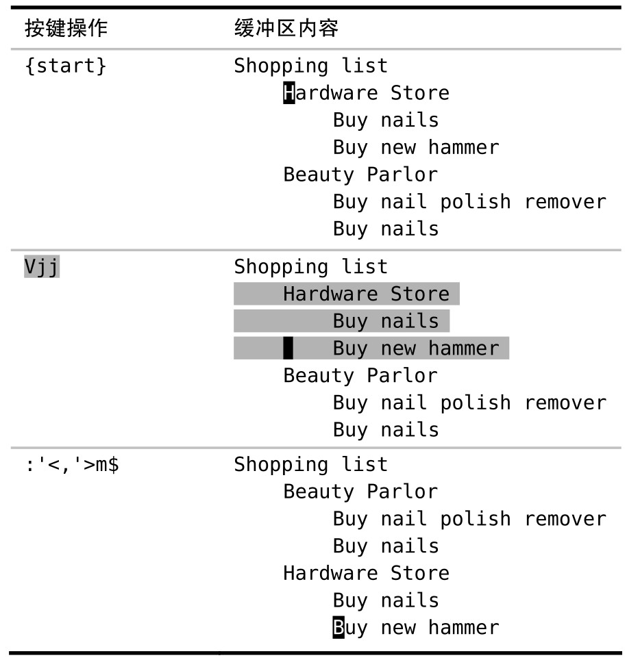

`:copy` 命令（及其简写形式 `:t`）让我们可以把一行或多行文本从文档的一个位置复制到另一个位置，而 `:move` 命令则可以让我们把一行或多行文本移到文档的其他地方 (目前 VSCodeVim 暂不支持 move)。

我们将使用如下购物清单作为演示：

## 用‘:t’命令复制行

这个购物清单还没完成，我们也要在五金商店（hardware store）买些钉子（nails）。为完成这个清单，我们将重用文件的最后一行，即在“Hardware Store”下面为之创建一份副本。我们可以用 Ex 命令 `:copy` 轻松地完成这项工作：

copy 命令的格式如下（参见:h :copy）：

`:[range]copy{address}`

在此例中，`[range]` 是第 6 行，而 `{address}` 用的是符号 `.`，它代表当前行。因此，我们可以把 `:6copy.` 命令解读为“为第 6 行创建一份副本，并放到当前行下方”。

`:copy` 命令可以简写为两个字母 `:co`，或者也可以用更加简练的 `:t` 命令，它是 `:copy` 命令的同义词。

为了更好地记忆，你可以把该命令想成“复制到（copy TO）”。下表展示了`:t` 命令的一些应用实例：

`:t.` 命令会创建一个当前行副本，而另外一种做法则是用普通模式的复制和粘贴命令（`yyp`）来达到同样的效果。这两种复制当前行的技术有个需要关注的差别：`yyp` 会使用寄存器，而 `:t.` 则不会。因此，当我不想覆盖默认寄存器中的当前内容时，有时我会使用 `:t.` 来复制行。

在上表中，也可以将 `yyp` 变化一下来复制我们想要的行，但不管怎样，这都需要一些额外的移动动作。我们得先跳到想复制的行上（`6G`），复制该行（`yy`），快速跳回原先的位置（`<C-o>`），然后再用粘贴命令（`p`）创建一个副本。由此可见，在复制距离较远的行时，`:t` 命令通常更加高效。

在 Ex 命令影响范围广且距离远中，我们已经了解了这个一般规律，即普通模式命令适合在当前屏幕可见范围内进行操作，而 Ex 命令则可以远距离操作。本节则以实例印证了这一规律。

## 用‘:m’命令移动行

`:move` 命令看上去和`:copy` 命令很相似（参见:h :move）：

`:[range]move{address}`

我们可以把它简写为一个字母`:m`。假设我们想把 Hardware Store 一节移到 BeautyParlor 一节的下方，用 `:move` 就可以实现这一点

在选中高亮选区后，只需简单地执行命令 `:'<,'>m$` 即可。另外还有种做法，我们也可以执行 `dGp`，此命令可以分解为：`d` 删除高亮选区，`G` 跳转到文件结尾，而 `p` 则粘贴刚刚删除的文本。

记住，`'<,'>` 代表了高亮选区。因此我们可以很容易地选中另外一个高亮选区，然后重复执行 `:'<,'>m$` 命令把选中的文本移到文件结尾。重复上次的 Ex 命令非常简单，只需按 `@:` 即可，所以这里所采取的方式与使用普通模式命令相比，在重复执行时会更方便。
