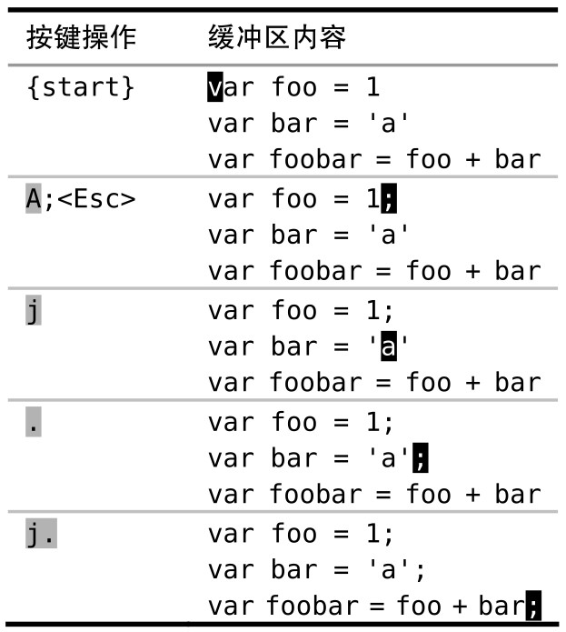
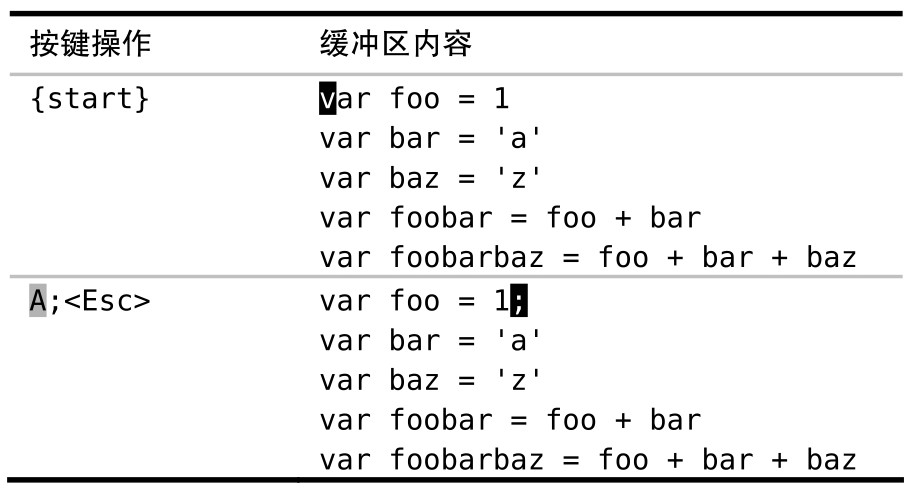
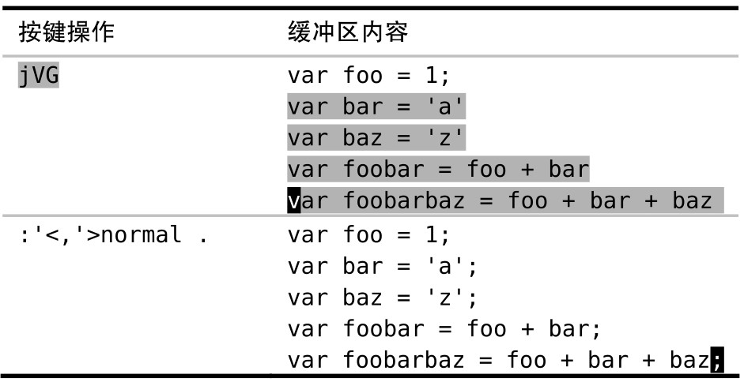

如果想在一系列连续行上执行一条普通模式命令，我们可以用 `:normal` 命令。此命令在与 `.` 命令或宏结合使用时，我们只需花费很少的努力就能完成大量重复性任务。

比如我们想在一系列行后添加一个分号：



使用点范式让我们迅速完成了这项工作，但是在这个例子里，只需对连续的 3 行做此修改。如果不得不做 50 次同样的修改会怎么样呢？如果还用点范式的话，得按 50 次 `j.`，总共得 100 次按键动作！

这里有一种更好的方法。我们将在下面文件的每行后都添加一个分号，以此作为演示。为节省空间，此处只列出了 5 行内容，然而你可以想象这里有 50 行，那么这种方法看起来就颇具诱惑了。

```
var foo = 1
var bar = 'a'
var baz = 'z'
var foobar = foo + bar
var foobarbaz = foo + bar + baz
```

我们像之前做的那样，首先修改第一行：



接下来，用不着一行一行地执行 `.` 命令，而是使用 Ex 命令 :normal 对整个范围内的所有行同时执行 `.` 命令：



`:'<,'>normal .` 命令可以解读为“对高亮选区中的每一行，对其执行普通模式下的 `.` 命令”。无论是操作 5 行还是 50 行文本，这种方法都能出色地完成任务，更棒的是我们甚至都不需要计算行数，在可视模式中选中这些行使我们摆脱了计数的负担。

这个例子使用 `:normal` 执行 `.` 命令，但是也可以用这种方式执行任意其他的普通模式命令。例如，可以用如下命令解决上面的问题：

➾:%normal A;

符号 `%` 代表整个文件范围，因此 `:%normal A;` 告诉 Vim 在文件每行的结尾都添加一个分号。在做此修改时会切换到插入模式，但是在修改完后 Vim 会自动返回到普通模式。

在执行指定的普通模式命令之前，Vim 会先把光标移到该行的起始处。因此在执行时，用不着担心光标的位置。例如，下面这条命令可以把整个 JavaScript 文件注释掉：

➾:%normal i//

虽然用 `:normal` 命令可以执行任意的普通模式命令，但是我发现当它和 Vim 的重复命令结合在一起时，最为强大，既可以用 `:normal .` 应对简单的重复性工作，也可以用 `:normal @q` 应对较复杂的任务。

在 Ex 命令影响范围广且距离远 中，我们说过 Ex 命令可以一次修改若干行。而 `:normal` 命令则让我们可以把具有强大表现力的 Vim 普通模式命令与具有大范围影响力的 Ex 命令结合在一起，这种结合真地是珠联璧合！
