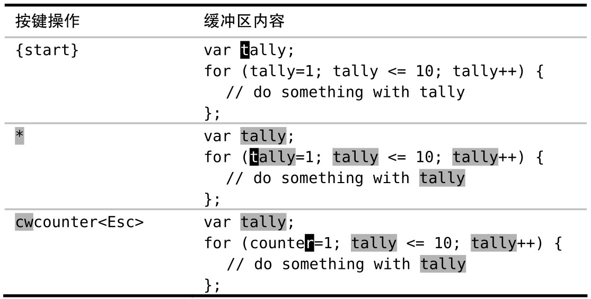

即使是在命令行模式下，Vim 也始终知道光标位于何处以及哪个分割窗口处于活动状态。为节省时间，我们可以把活动窗口中的当前单词（或字串）插入到命令行中。

在 Vim 的命令行下， `<C-r><C-w>` 映射项会复制光标下的单词并把它插入到命令行中。我们可以利用这一功能减少击键的次数。

假设我们想把下面这段代码中的变量 tally 重命名为 counter：

```
var tally;
for (tally=1; tally <= 10; tally++) {
  // do something with tally
};
```

把光标移到单词 tally 上后，用 `*` 命令就可以查找它出现的每处地方（`*` 命令等效于输入`/\<<C-r><C-w>\><CR>` 序列，关于 `\<` 和 `\>`在模式中的作用，以后会讲）。



当按下 `*` 键时，光标会正向跳到下一处匹配项，不过光标始终停留在相同的单词上。接下来，我们就可以输入 `cwcounter<Esc>` 对其进行修改。

然后，我们将用`:substitute` 命令完成其余的修改。由于光标已经在单词“counter”上了，因此我们无需再次输入它，而是直接用 `<C-r><C-w>`映射项把它插入到替换域：

➾`:%s//<C-r><C-w>/g`

这条命令看起来没省多少事，但是用两次按键就能插入一个单词不算太糟。此处也用不着输入查找模式，而这要感谢 `*` 命令。要知道为什么可以像上面这样将查找域留空，以后会讲

`<C-r><C-w>` 用于插入光标下的单词，而如果想插入光标下的字串的话，我们可以用`<C-r><C-a>`，更多细节请参见`:h c_CTRL-R_CTRL-W`。虽然本例是以 `:substitute` 命令作为示例的，但实际上这些映射项可用于任意 Ex 命令。

这里介绍另一种应用场景。试着打开你的 vimrc 文件，把光标移到其中的一项设置上，然后输入`:help<C-r><C-w>`，你就可以查阅该设置的文档了。
