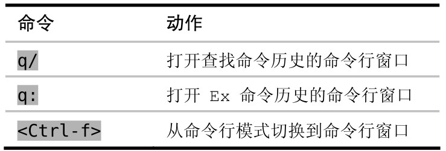

Vim 会记录命令行模式下的命令历史，并且可以很容易地回溯之前的命令，因此对于比较长的 Ex 命令来说，我们用不着在命令行中多次输入它。

我们先按 `:` 键切换到命令行模式，在保持提示符为空的情况下按 `<Up>` 键，此时最后执行的那条 Ex 命令就会被填充到命令行上。再接着按 `<Up>` 键的话，就可以回到更早的 Ex 历史命令；按 `<Down>` 键的话，则会沿相反方向滚动。

使用 `q:` 可以打开命令行窗口，命令行窗口就像是一个常规的 Vim 缓冲区，只不过它的每行内容都对应着命令历史中的一个条目。我们可以用 `<Up>` 和 `<Down>` 键在历史中向前或向后移动，也可以用 Vim 的查找功能查找某一行。在按下 `<CR>` 键时，将会把当前行的内容当成 Ex 命令加以执行。

Vim 不仅会记录 Ex 命令的历史，它也会为查找命令单独保存一份历史记录。在按 `/` 调出查找提示符后，用 `<Up>` 和 `<Down>` 键就可以正向或反向遍历之前的查找记录。从本质上讲，查找提示符只是命令行模式的另一种形式。

使用 `q/` 可以打开查找历史命令的命令行窗口

下表总结了打开命令行窗口的几种方式：

除了 `<Up>` 和 `<Down>` 键外，也可以用 `<C-p>` 和 `<C-n>` 组合键来反向或正向遍历命令历史。
