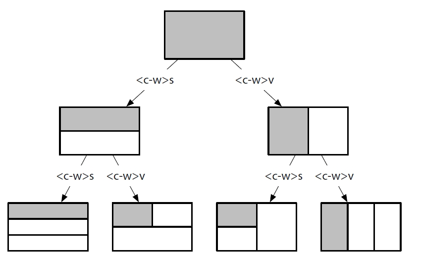
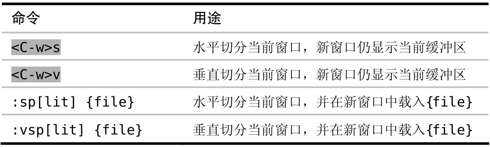
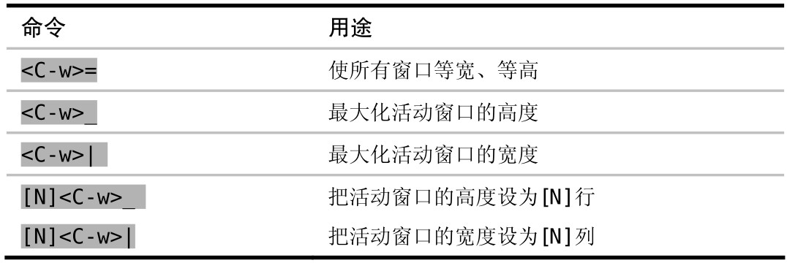

Vim 允许我们将工作区切分成若干窗口，在这些窗口里并排显示多个缓冲区。

## 创建分割窗口

Vim 在启动时只会打开单个窗口。用 `<C-w>s` 命令可以水平切分此窗口，使之成为两个高度相同的窗口；或者可以用 `<C-w>v` 命令对其进行垂直切分，这样会产生两个宽度相同的窗口。这两条命令可以重复任意多次，结果就会把工作区一次次地切分为更小的窗口，就像细胞分裂那样。

下图展示了切分后的效果，图中的阴影区域代表活动窗口。

每次执行完 `<C-w>s` 和 `<C-w>v` 命令后，新生成的两个窗口都会显示与原窗口相同的缓冲区。把同一缓冲区显示在不同窗口里会很有用，特别是在编辑长文件时。举个例子，我们可以滚动其中一个窗口，使之显示缓冲区的一部分，这样，在修改第二个窗口中缓冲区的另外一部分时，就可以参考第一个窗口中的内容。

我们可以用 `:edit` 命令把另外一个缓冲区载入活动窗口中。如果先执行 `<C-w>s`，再执行 `:edit {filename}`，就会把工作区分成两个窗口，并在其中一个窗口中打开新缓冲区，而另一个窗口则继续显示原有的缓冲区。另外一种做法是使用 `:split {filename}` 命令，它把上述两步合并成为了一步。下表总结了把工作区切分为窗口的几种方式：

## 在窗口间切换

Vim 提供了一些在窗口间进行切换的命令，下表总结了其中最常用的一些命令（完整命令列表参见:h window-move-cursor）：

实际上，`<C-w><C-w>` 完成的功能和`<C-w>w` 相同，就是说我们可以一直按住`<Ctrl>` 键，然后再输入 `ww`（或 `wj`，或上表中的其他命令）来切换活动窗口。`<C-w><C-w>` 要比 `<C-w>w` 更容易按一些，尽管写出来时它显得更繁琐。如果经常使用多个窗口，那么你可能需要考虑把这些命令映射成更方便的按键。

## 关闭窗口

想减少工作区中窗口的数量，可以用两种方式：一是使用 `:close` 命令关闭活动窗口，二是用 `:only` 命令关闭除活动窗口外的所有其他窗口。下表总结了这两条命令，并列出了与之等效的普通模式命令：

## 改变窗口大小及重新排列窗口

Vim 提供了一些用于改变窗口大小的按键映射项，完整的列表请查阅:h window-resize，下表中列出了最常用的几个命令：

改变窗口大小是我喜欢用鼠标做的少量操作之一，其做法很简单。点击窗口间的分隔线，拖动鼠标直至窗口变成期望的大小，然后松开鼠标即可。
