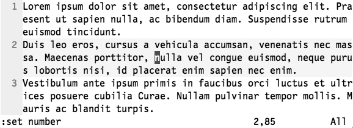
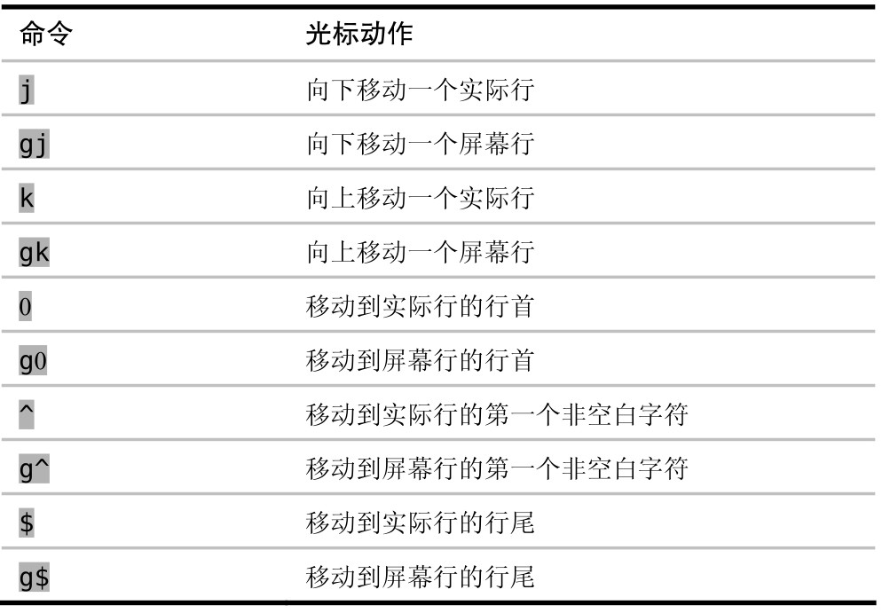

我们需要了解一下实际行与屏幕行间的差别，不然就很容易产生挫败感。Vim 允许我们针对此两者进行操作。

与许多文本编辑器不同，Vim 会区分实际行与屏幕行。当‘wrap’设置被启用时（缺省启用），每个超出窗口宽度的文本行都会被回绕显示，以保证没有文本显示不出来。这样一来，文件中的一行也许会被显示为屏幕上的若干行。

要想知道实际行与屏幕行之间的不同，最简单的方法是启用‘number’设置。启用后，以行号开头的行对应着一个实际行，它们会占据着屏幕上的一行或几行；当一行文本为适应窗口宽度而回绕时，回绕行的前面则不会显示行号。下面的屏幕截图中显示了一个缓冲区，它包括 3 个实际行（以行号标识），不过却显示为 9 个屏幕行。



理解实际行与屏幕行间的差别很重要，因为 Vim 提供了不同的动作命令来操作这两者。`j` 和 `k` 命令会根据实际行向下及向上移动，而 `gj` 和 `gk` 则是按屏幕行向下及向上移动。

以上面的屏幕截图为例，假设我们想把光标向上移，把它移到单词“vehicula”上。目标单词位于光标之上的一个屏幕行，因此我们按 `gk` 就可以移到那里；但如果是用 `k` 键的话，它会向上移动一个实际行，就把光标移到单词“ac”上去了，这并不是我们想要的结果。

另外，Vim 也提供了直接跳到行首及行尾的命令。下表对操作实际行和屏幕行的命令进行了总结：



你可以留意到这样一个特点，即 `j`、`k`、`0` 和 `$` 都用于操作实际行，而如果在这些键前加上 `g` 前缀的话，就会让 Vim 对屏幕行进行操作。

除 Vim 以外，其他大多数文本编辑器都没有实际行的概念，它们只提供操作屏幕行的手段。刚开始了解到 Vim 会区分对待这两者时，你可能会感觉不适。但当你学会使用 `gj` 和 `gk` 命令后，你就会感谢 `j` 和 `k` 可以让你用更少的键移动更远的距离。

重新映射面向行的动作命令

如果你想让 `j` 及 `k` 命令操作屏幕行而不是实际行，你可以重新映射一下它们。

```json
"vim.normalModeKeyBindings": [
  {
    "before": ["j"],
    "after": ["g", "j"]
  },
  {
    "before": ["k"],
    "after": ["g", "k"]
  },
  {
    "before": ["H"],
    "after": ["g", "^"]
  },
  {
    "before": ["L"],
    "after": ["g", "$"]
  },
]
```
