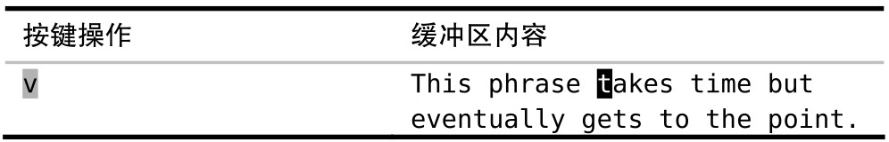
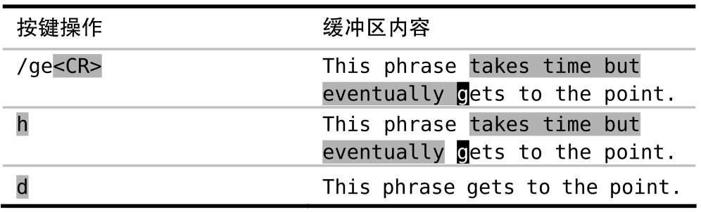
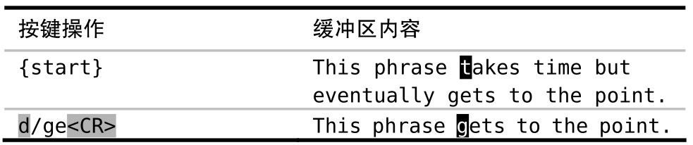

查找命令不仅限于在普通模式下使用，我们也可以在可视模式及操作符待决模式中使用它，用来完成实际的工作。例如，假设我们想删除下句中的“takes time buteventually”：


刚开始，我们按 `v` 切换到可视模式。接着我们将选区扩大，这可以通过查找字符串“ge”来完成，它一步就会把光标移到要去的地方。就快好了，不过还有个“差一错误”，即此选区包含了单词 get 词首的“g”，但我们并不想删除它。因此，得用 `h` 命令往回移一个字符。好了，确定了选区后，我们就可以用 `d` 命令删除该选区了。

还有种更快的方法完成同样的工作：


在这里，我们用 `/ge<CR>` 查找动作告诉 `d{motion}` 命令删除什么。查找命令是一个开动作，也就是说，虽然光标是在单词“gets”开头的“g”上的，但此字符却被排除在删除操作之外

如果不用可视模式的话，我们能省掉两次不必要的按键。不过可能你得练习一段时间才能习惯这种用法。学会把 `d{motion}` 操作符与查找动作结合在一起使用，这是个很大的进步，你可以好好在朋友和同事们面前炫耀一番了。
