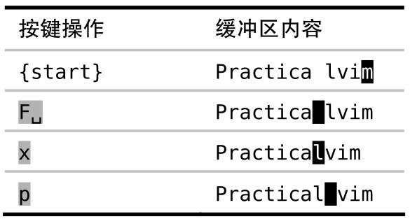
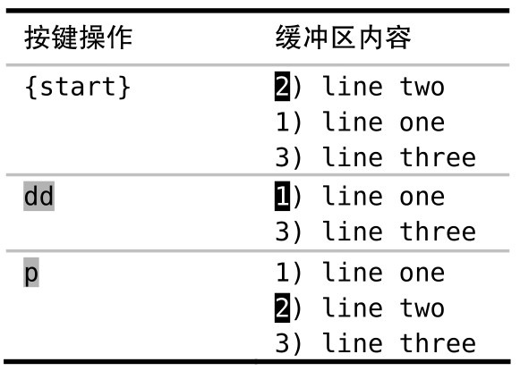
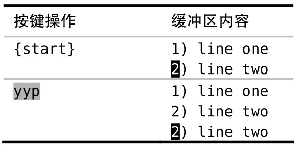
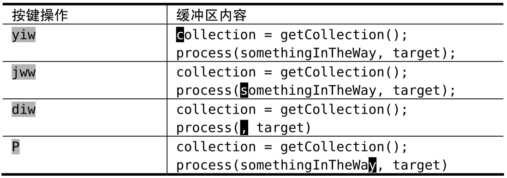

Vim 的删除、复制与粘贴命令的设计初衷是帮助人们轻松完成日常工作。接下来，我们将研究几个可用 Vim 无名寄存器轻松解决的问题，最后，我们将看到一个任务，要想完成它，要求我们对 Vim 寄存器的工作原理有更深入的了解才行。

通常情况下，在讨论剪切、复制与粘贴这 3 组操作时，指的都是操作系统剪贴板。不过，在 Vim 的术语里，我们操作的是寄存器，而并非剪贴板。在以后的技巧中，我们将看到 Vim 支持多组寄存器，并且还可以指定想用其中的哪一个。不过，先让我们看看用无名寄存器都能干些什么吧。

## 调换字符

我总爱拼错某些单词。久而久之，我发现自己会习惯性地输错某个单词，然后我会训练自己别再犯这样的错误。但有些拼写错误在所难免，最常见的拼写错误莫过于将两个字符的次序颠倒了，而 Vim 能够轻松修正此类错误。

假设我们在输入本书书名时犯了一个次序错误：



这次错误源于我们敲空格键敲得太快了，不过这很容易改正。在纠错过程中，首先，`F` 命令将光标移到要置换的第一个字符上。然后，`x` 命令把光标下的字符剪切下来，把它放到无名寄存器。最后，`p` 命令将无名寄存器中的内容粘贴到光标后面。

将最后两条命令组合在一起，即 `xp`，可被用于“调换光标之后的两个字符”。

## 调换文本行

类似地，我们也能方便地调换两行文本的顺序。这一次，我们不是用 `x` 命令剪切当前字符，而是用 `dd` 命令剪切当前行，从而将其内容存入无名寄存器中：



`p` 命令知道我们正在处理的是一整行文本，因此，如我们所愿，它把无名寄存器的内容粘贴至当前行的下一行。还记得吗，在上一个例子中，当我们按下 `xp` 时，`p` 命令是将内容粘贴至光标之后的。

把以上命令序列连起来，即 `ddp`，可被用于“调换当前行和它的下一行”。

## 创建文本行的副本

假设我们想创建一行新的文本，内容与之前某行类似，只有一两处差异。为此，我们可以先创建一行已有文本的副本，以此作为再加工的模板。要在 Vim 中实现这一功能，需要我们先复制一行，然后紧接着进行粘贴：



请注意 `ddp` 与 `yyp` 这两组按键操作的相似之处。前者是对文本行的剪切与粘贴操作，实际上是调换了两行的顺序。后者是针对行的复制与粘贴操作，即创建一行副本。

## 糟糕！我弄丢了复制内容

到目前为止，Vim 的删除、复制与粘贴操作看起来都非常直观，这些操作使得我们的日常工作得以轻松完成。现在让我们再来看一个场景，这次完成起来可没那么顺利。示例如下：

```
collection = getCollection();
process(somethingInTheWay, target);
```

我们打算复制 collection 至无名寄存器，并用刚刚复制的内容替换 somethingInTheWay。下图展示了我们第一次尝试的过程。



由于光标一开始就已经位于要复制的单词之上，因此，我们只需输入 `yiw` 即可将其复制到无名寄存器中。

接下来，我们把光标移到要粘贴“collection”的位置，但在粘贴之前得先清理出一块空白区域才行。因此我们运行 `diw`，将 somethingInTheWay 一词删除。

现在，我们可以按 `P` 键将无名寄存器的内容粘贴至当前光标前面了。但我们得到的单词是“somethingInTheWay”，而不是之前复制的“collection”。到底发生了什么事？

`diw` 命令不仅删除了单词，而且还将它拷贝到了无名寄存器。改用广为人知的术语来说，`diw` 命令把该词剪切掉了。

很明显，我们做错了什么。当运行 `diw` 命令时，无名寄存器的内容被覆盖了。这就是为什么我们按 `P` 时得到的是刚刚删除的单词，而不是之前复制的单词。

为了解决这个问题，我们得深入了解 Vim 寄存器的工作原理才行。

注：这里还有另一种方法解决：`diw` 改为 `viw`，然后按 `p` 即可，即：先选中，再粘贴，不过还是把“somethingInTheWay”复制到无名寄存器中了

要想连续粘贴相同的内容，可以修改一下 `p` 键：

```json
"vim.visualModeKeyBindingsNonRecursive": [
  // 在可视模式下绑定 p 以粘贴而不覆盖当前寄存器：
  {
    "before": ["p"],
    "after": ["p", "g", "v", "y"]
  }
],
```
