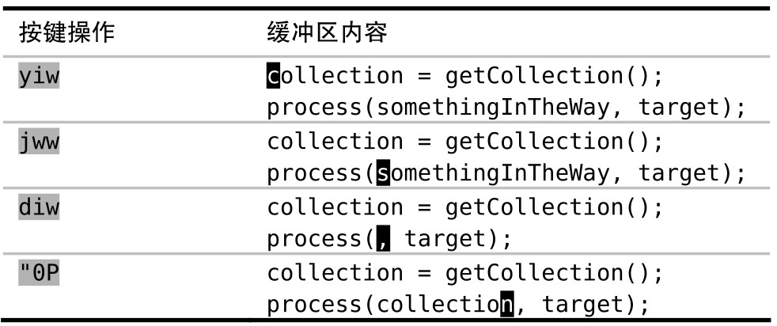
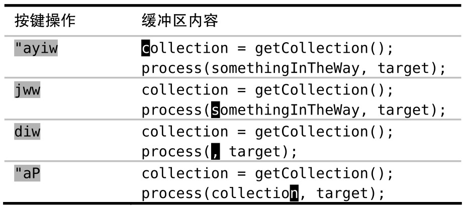
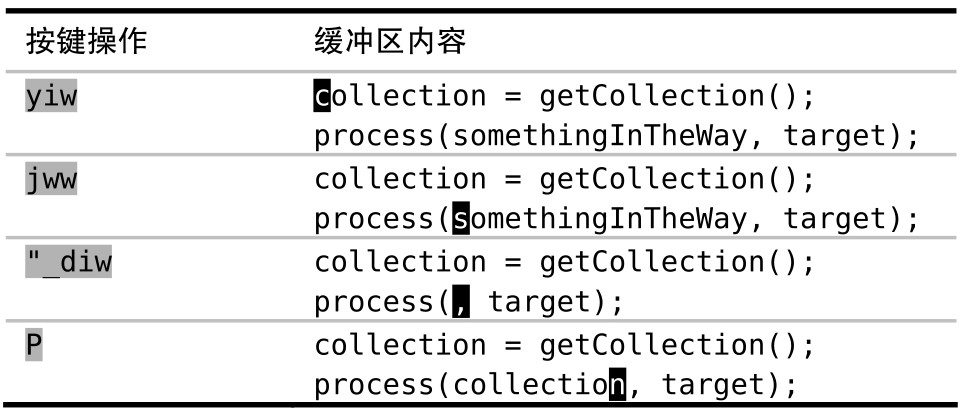
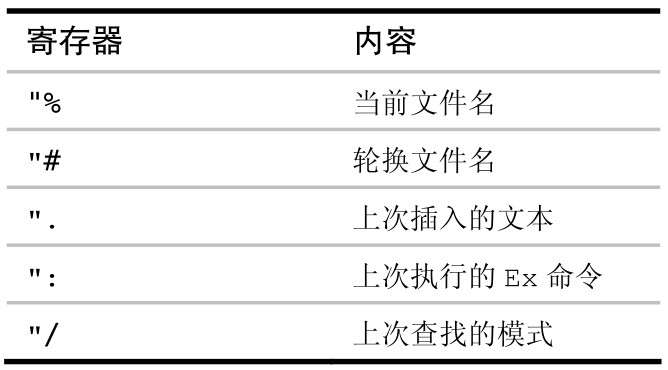

Vim 不使用单一的剪贴板进行剪切、复制与粘贴操作，而是为这些操作提供了多组寄存器。当使用删除、复制与粘贴命令时，我们可以明确指定它们中的某一个进行操作。

## 引用一个寄存器

Vim 的删除、复制与粘贴命令都会用到众多寄存器中的某一个。我们可以通过给命令加 `"{register}` 前缀的方式指定要用的寄存器。若不指明，Vim 将缺省使用无名寄存器。

## Vim 术语对照表

剪切（cut）、复制（copy）与粘贴（paste），这些都是众所周知的术语，而且大多数桌面软件和操作系统都支持这 3 类操作。Vim 当然也提供这些功能，只不过使用的是另外的术语 delete、yank 与 put。

Vim 的 put 命令与粘贴操作完全相同。幸运的是，两词均以字母 `p` 开头，因此即使术语不同，也不会影响记忆。

Vim 的 yank 命令也等同于复制操作。但由于历史原因，当时 `c` 命令已经被用于修改（change）操作了，因此 Vi 的作者们被迫选择了另一个名字 yank。由于那时 `y` 键还可用，因此它就成了复制操作的命令。

Vim 的 delete 命令也与标准剪切操作的作用一致。也就是说，该命令会先把指定文本复制到寄存器后再从文档中删掉。能够理解这一点，是避开类似糟糕！我弄丢了复制内容所遇到的常见陷阱的关键。

你也许好奇，Vim 中真正删除文本的操作是什么。也就是说，我们怎样才能删除文本而不把其内容复制到任何寄存器？答案是使用名为“黑洞”的特殊寄存器，顾名思义，放到这里的文本真地是有去无回了。用下划线符号（参见 :h quote\_）可以引用黑洞寄存器。因此，`"_d{motion}`会执行真正的删除操作。

让我们看一些引用寄存器的例子，如果我们想把当前单词复制到寄存器 `a` 中，可执行 `"ayiw`，或者，可以用 `"bdd`，把当前整行文本剪切至寄存器 `b` 中。在此之后，我们既可以输入 `"ap` 粘贴来自寄存器 `a` 的单词，也可使用 `"bp` 命令粘贴来自寄存器 `b` 的一整行文本，两者互不干扰。

除了普通模式的命令外，Vim 也提供用于删除、复制与粘贴操作的 Ex 命令。例如，我们可以执行 `:delete c`，把当前行剪切到寄存器 `c`，然后再执行 `:put c` 命令将其粘贴至当前光标所在行之下。相比普通模式的命令而言，这些操作看似繁琐，但如果将它们与其他 Ex 命令结合起来使用，或者用于 Vim 脚本编程，将会更方便。

## 无名寄存器（""）

倘若我们没有指定要使用的寄存器，Vim 将缺省使用无名寄存器，它可以用双引号表示（参见:h quote_quote）。为了显式地引用该寄存器，我们得使用两个双引号。例如，`""p`，它完全等同于 `p` 命令。

`x`、`s`、`d{motion}`、`c{motion}` 与 `y{motion}` 命令（以及它们对应的大写命令）都会覆盖无名寄存器中的内容。无论哪一种情况，都可以通过加 `"{register}`前缀来指定另外一个寄存器，但无名寄存器总是缺省的。事实上，无名寄存器的内容很容易被覆盖，如果我们不小心的话，会导致问题发生。

请再回想一下糟糕！我弄丢了复制内容中的例子。一开始，我们复制了文本（单词“collection”）并打算粘贴到其他地方，在粘贴之前，我们在选好的位置删除了一些文本，旨在清理出一块空白区域，而正是这一操作导致了无名寄存器的内容被覆盖。当我们再次使用 `p` 命令时，粘贴的是刚刚删除的文本，而不是之前复制的文本。

在这一点上，Vim 术语的命名确实有问题。`x` 和 `d{motion}` 经常被当作“删除”命令。这其实是用词不当，把它们理解为“剪切”命令会更合适。无名寄存器中经常找不到我想要的文本，不过幸运的是，复制专用寄存器要更可靠些。

## 复制专用寄存器（"0）

当我们使用 `y{motion}` 命令时，要复制的文本不仅会被拷贝到无名寄存器中，而且也被拷贝到了复制专用寄存器中，后者可用数字 0（参见:h quote0）加以引用。

复制专用寄存器，顾名思义，仅当使用 `y{motion}` 命令时才会被赋值。换句话讲，使用 `x`、`s`、`c{motion}` 以及 `d{motion}` 命令均不会覆盖该寄存器。如果我们复制了一些文本，可以确信该文本会一直保存于寄存器 `0` 中，直到我们复制其他文本时才会被覆盖。复制专用寄存器是稳定的，而无名寄存器是易变的。

我们可以用复制专用寄存器解决糟糕！我弄丢了复制内容 中的问题。



尽管 `diw` 命令仍会覆盖无名寄存器，但不会波及复制专用寄存器。我们可以通过输入 `"0P`，安全地粘贴来自复制专用寄存器中的内容。这一次 Vim 终于给出了我们想要的文本。

如果我们此时检查无名寄存器和复制专用寄存器的内容，会发现它们分别保存着刚刚被删除与复制的文本：

➾:reg "0

```
《 --- Registers ---
"" somethingInTheWay
"0 collection
```

## 有名寄存器（"a – "z）

Vim 提供了一组以 26 个英文字母（参见:h quote_alpha）命名的有名寄存器。这意味着我们可以剪切（`"ad{motion}`）、复制（`"ay{motion}`）或者粘贴（`"ap`）多达 26 段文本。

可以用有名寄存器解决糟糕！我弄丢了复制内容 中的问题。



使用有名寄存器需要额外的按键操作，因此对于类似本例的简单问题，最好使用复制专用寄存器（`"0`）。如果碰到需要将一段或多段文本粘贴到多处的情况，有名寄存器就会大显神通。

用小写字母引用有名寄存器，会覆盖该寄存器的原有内容，而换用大写字母的话，则会将新内容添加到该寄存器的原有内容之后。

## 黑洞寄存器

黑洞寄存器是个有去无回的地方，可用下划线（参见:h quote\_）引用它。如果我们运行 `"_d{motion}` 命令，Vim 将删除该文本且不保存任何副本。当我们只想删除文本却不想覆盖无名寄存器中的内容时，此命令很管用。

可以用黑洞寄存器解决糟糕！我弄丢了复制内容中的问题。



## 系统剪贴板（"+）与选择专用寄存器（"\*）

到目前为止，我们所讨论的寄存器都是 Vim 内部的。如果想从 Vim 复制文本到外部程序（反之亦然），则必须使用系统剪贴板。

Vim 的加号寄存器与系统剪贴板等效，可用 `+` 号（参见:h quote+）引用。

如果我们在外部程序中用剪切或复制命令获取了文本，就可以通过 `"+p` 命令（或在插入模式下用 `<C-r>+`）将其粘贴到 Vim 内部。相反地，如果在 Vim 的复制或删除命令之前加入 `"+` ，相应的文本将被捕获至系统剪贴板。这意味着我们能够轻松地把文本粘贴到其他应用程序中了。

X11 视窗系统支持另一种被叫作主剪贴板（primary）的剪贴板，它保存着上次被高亮选中的文本，可以用鼠标中键（如果有的话）把它们粘贴出来。Vim 的星号寄存器对应主剪贴板，可用 `*` 号（参见:h quotestar）加以引用。



Windows 与 Mac OS X 操作系统并没有主剪贴板的概念，因此 `"+` 寄存器与 `"*` 寄存器可以混用，它们都代表系统剪贴板。

## 表达式寄存器（"=）

Vim 的寄存器通常被认为是保存一段文本的容器。然而，通过 `=` 号（参见 :h quote=）引用的表达式寄存器却是个例外。当我们从表达式寄存器获取内容时，Vim 将跳到命令行模式，并显示提示符“=”。这时，我们可以输入一段 Vim 脚本表达式并按 `<CR>` 执行，如果返回的是字符串（或者可被强制转换成字符串的数据），Vim 将会使用它。

这里只做了解，VSCodeVim 并不支持

## 其他寄存器

我们可以显式地使用删除与复制命令，来设置有名、无名以及复制专用寄存器的内容。另外，Vim 还提供了几组可被隐式赋值的寄存器。它们被称作只读寄存器（参见:h quote.），如下图所示：



技术上讲，`"/` 寄存器并非只读，可以用`:let` 命令（参见:h quote/）对其进行显式的赋值。但为了方便起见，我们仍把它列入该表。
