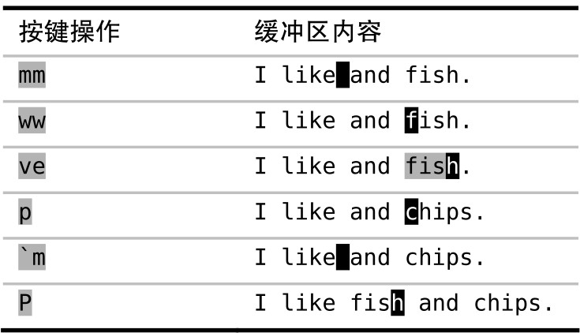

Vim 的粘贴命令在可视模式下使用时，会体现出一些不同寻常的特性。我们将在本节深入挖掘其可用价值。

在可视模式下使用 `p` 命令时，Vim 将用我们指定的寄存器内容来替换高亮选区中的文本（参见 :h v_p）。我们可以利用该功能解决糟糕！我弄丢了复制内容中的问题。


对于这个特定问题，此法是我本人最中意的方案，它不再把无名寄存器既用于复制又用于删除，因为根本就没有删除这一步。相反的，我们把删除和粘贴合成了一步，完成高亮选区的替换。

当然，了解此法的副作用也很重要。首先，我们输入 `u` 撤销上次的修改。然后，按 `gv` 重选上一次高亮选区的内容，再按一次 `p` 键。发生了什么？显然什么也没发生。

如果要达到我们的目的，还得按 `"0p`，即用复制专用寄存器的内容替换高亮选区中的文本。我们在第一次使用 `p` 时，之所以成功，是因为无名寄存器恰巧包含了我们想要的文本。但在第二次使用 `p` 时，无名寄存器包含的是被覆盖的内容，即 somethingInTheWay。

为了进一步解释这事有多离奇，让我们假设有一个 API，它为标准的剪切、复制与粘贴操作提供服务。该 API 有两个名为 setClipboard() 与 getClipboard() 的成员方法。剪切与复制操作都调用 setClipboard() ，而粘贴操作调用 getClipboard()。在 Vim 的可视模式下使用 `p` 命令时，会先后调用这两个方法。首先，从无名寄存器里取出内容，然后，把高亮选区中的内容存入无名寄存器。

继续沿着思路想下去，高亮选区中的内容与寄存器的文本被调包了。这是原本的设计初衷还是漏洞？你自己看着办吧。

要想连续粘贴相同的内容，可以修改一下 `p` 键：

```json
"vim.visualModeKeyBindingsNonRecursive": [
  // 在可视模式下绑定 p 以粘贴而不覆盖当前寄存器：
  {
    "before": ["p"],
    "after": ["p", "g", "v", "y"]
  }
],
```

不过你就无法使用下面的技巧了

交换两个词

针对 Vim 在可视化粘贴时的这一特点，我们可以加以利用。假设我们想交换以下句中两个单词的次序，改为“fish and chips”。




首先，我们使用 `de` 把单词“chips”剪切掉，实际上是把它复制到了无名寄存器；然后，再选中要替换的单词“fish”。当我们执行 `p` 命令时，单词“chips”将重新出现在文档中，而单词“fish”则会被复制到无名寄存器。最后，我们把光标重新移到因删除“chips”而留下的空白处，再将单词“fish”从无名寄存器粘贴回文档即可。

针对此例而言，如果我们用 `c3w` 命令删除“chips and fish”并重新输入“fish and chips”，应该会更快地完成任务。但是，以上方法可被用于交换更长的短语。

`m{char}` 命令负责设置标记，而 `{char} 命令将跳转到该标记。
