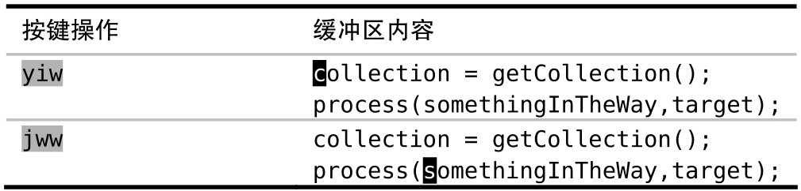
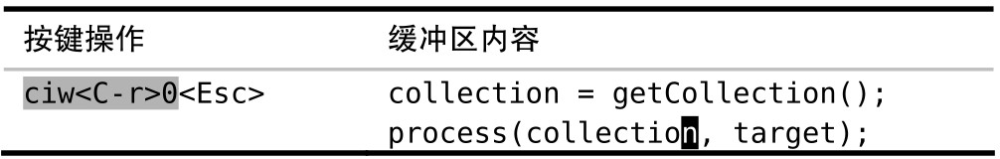
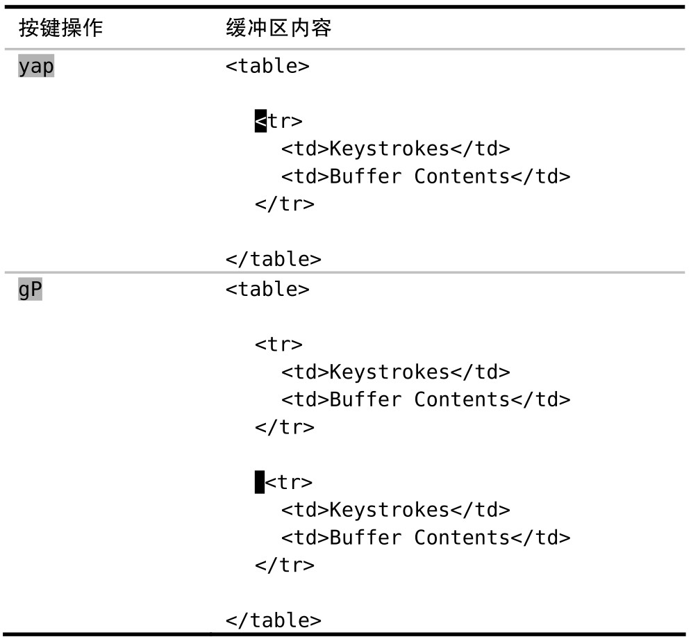

普通模式下的粘贴命令，根据要插入文本的性质不同，执行结果也不同。确定要粘贴的文本区域是面向行的还是面向字符的，将有助于我们制定不同的策略。

在前面的技巧中，我们见识了用 `xp` 命令调换两字符的次序以及用 `ddp` 命令调换两行的顺序。尽管这两种情况都用到了 `p` 命令，但结果却略有差异。

`p` 命令旨在将寄存器中的文本粘贴到光标之后（参见:h p）。作为补充，Vim 也提供了（大写的）`P` 命令用于将文本插入到光标之前。至于当前光标前后的位置具体在哪，得根据将要插入的寄存器内容而定。

以 `xp` 为例，寄存器仅包含一个字符。因此，`p` 命令直接将寄存器的内容粘贴至当前光标所在位置之后。

而在 `ddp` 的例子中，寄存器包含一整行文本。因此，`p` 命令将寄存器内容粘贴至当前光标所在行的下一行。

怎样才能知道 `p` 命令是把寄存器的文本粘贴到当前字符之后还是当前行之后呢？这取决于这个指定的寄存器是怎样被赋值的。面向行的复制或者删除操作（例如：`dd`、`yy` 或者 `dap`），将创建面向行的寄存器；而面向字符的复制或者删除操作（例如：`x`、`diw` 或者 `das`），则创建面向字符的寄存器。一般而言，使用 `p` 命令的结果会一目了然。（更多细节，请参见 :h linewise-register。）

## 粘贴面向字符的区域

假设当前缺省的寄存器存有单词“collection”，我们想把它粘贴出来，用作函数调用的第一个参数。使用 `p` 还是 `P` 命令取决于当前光标的位置。缓冲区中的内容如下所示：

```
collection = getCollection();
process(, target); // 当前光标在 ( 上
```

比较另外一种情况：

```
collection = getCollection();
process(, target); // 当前光标在 , 上
```

第一种情况要用 `p` 命令，而第二种情况应该用 `P` 命令。我认为这种方式很不直观，事实上，由于我经常犯此类错误，`puP` 和 `Pup` 几乎成了下意识动作。

我不喜欢被迫去判断面向字符的文本区域到底是放在光标之前还是之后。因此，较之使用普通模式的 `p` 和 `P` 命令，我有时更喜欢在插入模式中使用 `<C-r>{register}`的映射项，来粘贴面向字符的文本区域。通过这种方式，寄存器的文本总会被插入至光标之前，就像我们在插入模式下手动输入它们一样。

在插入模式下，我们可以通过输入 `<C-r>"` 来插入无名寄存器的内容，或者输入 `<C-r>0` 来插入复制专用寄存器的内容。这种方法也可以解决糟糕！我弄丢了复制内容 中的问题。





使用 `ciw` 命令带来的额外好处是，此时用 `.` 命令可以把当前单词替换为“collection”。

## 粘贴面向行的区域

当要粘贴的内容来自于面向行的寄存器时，`p` 和 `P` 命令会把它们粘贴至当前行的上一行或下一行。这一点比面向字符的行为更直观。

Vim 提供的 `gp` 和 `gP` 命令也值得关注，因为它们同样可以将文本粘贴至在当前行之前或之后。不同的是，它们会把光标的位置移到被粘贴出来的文本结尾而不是开头。当复制多行文本时，`gP` 命令尤为管用，例如：



我们可以把该文本的副本当作模板，再根据要求修改表中单元格的内容。`P` 和 `gP` 命令都工作得很好，但有一点除外，前者会将光标移到被插入进来的文本上方，而 `gP` 命令会将光标移到第二段副本的位置，从而让我们可以方便地根据需要进行修改。

## 结论

`p` 与 `P` 命令对于粘贴多行文本区域非常重要，但是对于小段的、面向字符的文本来讲，使用 `<C-r>{register}` 映射项的方式会更直观。
