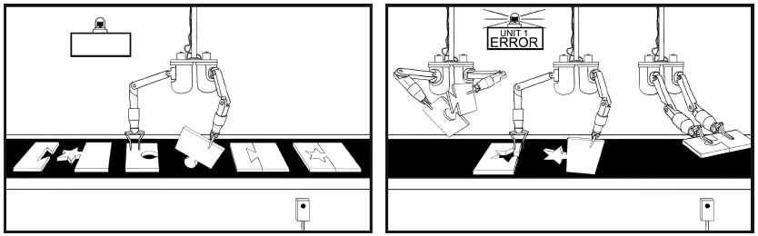

宏允许我们把一段修改序列录制下来，用于之后的回放。本节将对其细节进行深度剖析。

许多重复性的任务都会涉及多处修改。如果想要自动完成这些修改，我们可以录制一个宏，然后执行它。

## 把命令序列录制成宏

`q` 键既是“录制”按钮，也是“停止”按钮。为了录制我们的按键操作，一开始需要按 `q{register}`，从而指定一个用于保存宏的寄存器。当状态栏中出现“Recording”时，表示录制已经开始。此后，我们执行的每一条命令都将被宏捕获，直到我们再次按下 `q` 键停下为止。

让我们看看具体的操作：


首先，我们输入 `qa` 开始录制宏并将其内容保存至寄存器 `a` 中，然后，在第一行上做两处修改，在行尾添加一个分号，再在行首添加一个单词 `var`。在完成这些修改后，按 `q` 键停止宏的录制。

我们可以通过以下命令查看寄存器 `a` 中的内容：

➾:reg a

```
《 --- Registers ---
"a A;<Esc>Ivar <Esc>
```

## 通过执行宏来回放命令序列

我们可以用 `@{register}` 命令执行指定寄存器的内容（参见:h @)，也可以用 `@@` 来重复最近调用过的宏。

下面是一个例子：


通过执行这个刚刚录制好的宏，Vim 对随后的每一行也重复了这两处相同的修改。

注意：我们在第一行用 `@a` 回放宏，而在下一行用 `@@` 来回放同样的宏。

在此例中，我们通过运行 `j@a`（之后运行 `j@@`）来执行宏。从表面上看，该操作类似于 `.` 范式。它包含一个用来移动的按键动作（`j`）和两个用来执行的按键动作（`@a`）。看起来不错，但还有改进的余地。

有几种技术可供我们在多次执行宏时使用。它们设置起来区别不大，重点是在运行中遇到错误时，它们的处理方式有所不同。下面我将以圣诞树上的小彩灯为例，来解释这些差异。

如果你买了一组廉价的晚会用的彩灯，各个灯泡之间很可能是被串联起来的，这意味着如果一只灯泡烧坏了，所有灯泡都会熄灭。但如果你买的是高级产品，各个灯泡之间则更有可能是并联连接的，这意味着不论是哪一支灯泡坏了，都不会影响其他灯泡。

借用电气领域串并联的概念，我刚刚为大家梳理了两种用于多次执行一个宏的技术区别。以串行方式执行宏的技术十分脆弱，就像圣诞树上的廉价小彩灯，极易损坏。而以并行方式执行宏的技术，容错性会更强。

## 以串行方式执行宏

下图所展示的，是机器人如何通过机器臂将传送带上的一连串零件装配到一起的过程。录制宏的过程很像是为机器人编写“完成一道工序”的程序。作为最后一步，我们命令机器人移动传送带并抓住下一个零件。按照这种方式，只需一个机器人就能在相似的零件上执行一系列重复的工序了。



采用此法的后果之一，是如果机器人遇到了特殊情况，必须发出警报并中止操作。即使传送带上仍有零件需要装配，也只能放弃。

## 以并行方式执行宏

以并行方式执行宏，就好像完全不用传送带，取而代之的，是部署一组机器人。我们同样要控制它们完成刚才那个简单的任务。这一次，我们安排一个机器人只干一种工作。如果某个机器人能完成交给它的任务固然很好，但若失败了，也不会影响其他机器人。

无论我们使用哪一种技术，从本质上讲，Vim 一直会顺序地执行宏。“并行”一词意在类比并联电路的健壮性，并不是说 Vim 真地会并发地执行多处修改。

在以后的技巧中，我们将看到以串行方式和以并行方式执行宏的一些例子。
