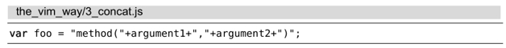
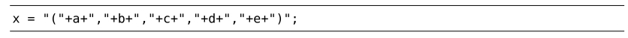
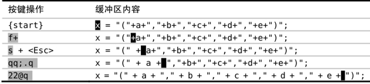

对于重复次数不多的工作，点范式是一种高效的编辑策略，但它不能指定执行的次数。为了克服该限制，我们可以录制一个简单的、一次性的宏，然后再加次数进行回放。

在技巧以退为进中，我们用点范式处理过这行文本：

现在，我们打算把它变成这个样子：

使用点范式，意味着完成这个任务只需简单地重复执行几次 `;.` 命令。但如果在更大范围内遇到这种问题，该怎么办呢？

当然，我们仍然可以使用点范式，但这需要调用那么多次 `;.` 命令才能完成任务，工作量似乎也不小。有什么方法能让我们用次数的方式执行呢？

人们很自然地想到 `11;.` 应该能完成这项工作，但实际上它不管用。因为 Vim 会先运行 11 次 `;` 命令，再运行 1 次 `.` 命令。类似地，如果我们运行 `;11.` 的话，错误会更明显，因为它会指示 Vim 先调用 1 次 `;`，再调用 11 次 `.`。而我们的真正目的是要运行 11 次 `;.`。

通过录制一个最简单的宏，我们可以模拟执行 11 次的 `;.`，即 `qq;.q`。首先，`qq` 将指示 Vim 录制后续的按键操作并将它们保存至寄存器 `q` 中。然后，我们再输入命令 `;.`。最后，我们按下 `q` 键结束宏的录制。现在可以加上次数 `11` 执行这个宏 `11@q`，即执行 11 次 `;.`。

让我们归纳一下步骤

`;` 命令会重复 `f+` 的查找动作。当光标移到文本行最后一个字符 + 后面时，动作命令 `;` 将会执行失败，宏随即中止执行。

在本例中，我们打算将这个宏执行 10 次。但如果回放 11 次的话，最后一次执行将会被中止。换句话说，只要我们用大于或等于 10 的次数调用该宏就可以完成任务了。

谁愿意坐在那里精确计算一个宏需要被执行多少次呢？反正我不愿意。为了完成该任务，我宁愿估算一个足够大的次数。出于懒惰的缘故，我通常用 22 这个数字，因为在我的键盘上，字符 @ 与 2 在同一个键上，容易输入。

注意：不是每个宏都能用估算次数的方法调用。本例之所以可以这样，是因为该宏本身隐含了一种内置的安全捕获机制。如果在当前行找不到下一个 + 号时，`;` 动作命令会失败。
