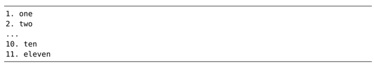
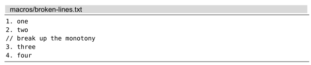

对于多行范围内的重复性改动，可以先录制一个宏，然后再在每一行上回放，这将会极大减轻我们的工作量。该功能可用两种执行宏的方式实现，串行或者并行。

我们将对以下文本片段进行转换，演示其用法：

转换后的结果如下所示：

尽管此任务可能看起来比较简单，但由它引申出来的几个问题却很值得玩味。

## 录制工作单元

我们先在第一行上做出修改，并将其录制下来：

注意动作命令在该宏中的用法。首先，我们输入 `0` 命令，将光标置于行首，从而规范了光标的位置。这意味着下一条动作命令总是从相同的位置开始执行，重复性更强。

有些人可能认为，接下来的动作命令 `f.` 有浪费之嫌。此命令仅仅将光标向右移动一步，作用与 `l` 命令相同。为什么一次按键就可以完成的事情，非得用两次呢？

再强调一遍，这正是为了能够重复。在本例的文本段中，行号只是从 1 排到了 4，但假设编号变成两位数呢？

在前 9 行中，`0l` 会把光标移到每行的第二个字符上，此处刚好是一个句号。但从第 10 行起，这条动作命令还没到达目标就戛然而止了。然而，`f.` 对所有文本行都适用，甚至行号超过百位也没问题。

另外，使用 `f.` 这条动作命令会为我们增加一种安全捕获机制。如果在当前行没找到字符 `.` ，`f.` 命令会提示一个错误，宏将中止执行。稍后我们将会用到这一特点，所以请大家牢记这种用法。

## 以串行方式执行宏

我们可以用 `@a` 执行刚刚录制好的宏，它将执行以下步骤：首先，把光标移到该行首个 . 字符上，把 . 改成 ) ，然后，将下一个单词的首字母变为大写，最后，将光标移至下一行。

我们可以调用 3 次 `@a` 命令完成这次任务，但运行 `3@a` 会更快：

让我们来看一个新的难题。假设即将要处理的文本中，会时不时地被注释行所隔断：

现在看一看，如果我们试着在这个文件中回放同样的宏的话，会发生什么事情。

宏在执行到第 3 行时停了下来，没错，就是那行注释。`f.` 命令没有在这行发现字符 `.` ，于是宏被中止执行了。安全捕获机制截住了我们，这也是个好事情，因为如果该宏成功地在这行执行了，也就意味着它做了我们可能根本不想要的修改。

但是问题还没解决呢。我们本来指示 Vim 执行 5 遍宏，但到第 3 遍时它就罢工了。因此，为了完成任务，我们不得不再次在其余几行上调用宏。接下来，让我们看看另一种技术吧。

## 以并行方式执行宏

技巧[在指定范围上执行普通模式命令](/pages/a344b8/)展示过一种方法，在一组连续的文本行上运行 `.` 命令。在这里，我们也可以使用相同的技术：

我们又重新录制了宏。这一次，除了省略向下移动的 `j` 命令（最后一条）外，宏命令没变，因为这一次，我们不再需要它移动光标至下一行了。

`:normal @a` 命令指示 Vim 在高亮选区中的每一行上执行这个宏。像上次一样，宏在前两行执行成功了，但在第 3 行被中止了，但这次它并没有停在那儿，而是继续完成了任务。这是为什么呢？

之前我们运行 `5@a` 时，是以串行、队列的方式依次执行这 5 条重复的命令。当第 3 次迭代被中断时，队列中剩余的命令将被清除。而这一次，我们把 5 次迭代过程并行执行，由于宏与宏之间的调用相互独立，因此，即使第 3 次迭代失败了，也不会影响其他迭代过程。

## 决策：串行还是并行？

串行或者并行，哪种方式更好呢？答案（永远）是看情况。

以并行的方式在多处执行宏更为健壮。在本例中，采用这种方法会更好。但如果宏在执行时遇到一处错误，而我们正想利用这些警告更正错误时，以串行、多次的方式执行宏可以更容易定位出问题所在。

在掌握这两种技术后，你将可以自己判断在哪种情况下应该使用哪种方式了。
