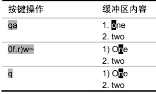
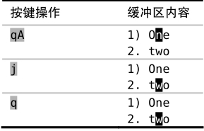

有时候，我们在录制宏的过程中会漏掉某个至关重要的步骤。在这种情况下，我们没必要从头开始重录所有的步骤，而是可以在现有宏的结尾附加额外的命令。

假设要录制以下宏：

我们刚一按下 `q` 键，停止了宏的录制，才发现应该在结束之前按一下 `j` 键，将光标移至下一行。

在解决此问题之前，先检查一下寄存器 `a` 中的内容：

➾:reg a

《 "a 0f.r)w~

在我们输入 `qa` 时，Vim 将开始录制接下来的按键操作，并将它们保存到寄存器 `a` 中，这会覆盖该寄存器原有的内容。如果我们输入的是 `qA` 的话，Vim 也会录制按键操作，但会把它们附加到寄存器 `a` 原有的内容之后。我们可以用这种方式更正该错误：

现在，让我们再检查一下寄存器 `a` 有什么变化：

➾:reg a

《 "a 0f.r)w~j

第一次录制的所有命令还在那里，只不过现在变成以 `j` 结尾了。

结论

这条小技巧把我们从“被迫重新录制宏”的窘境中解救出来。但此法只能在宏的结尾添加命令，如果想在宏的开头或者中间的某个位置添加内容的话，它就无能为力了。
