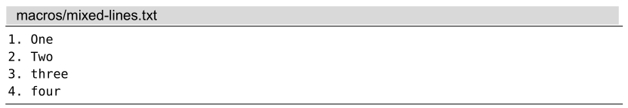
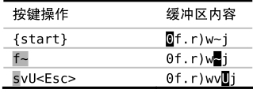
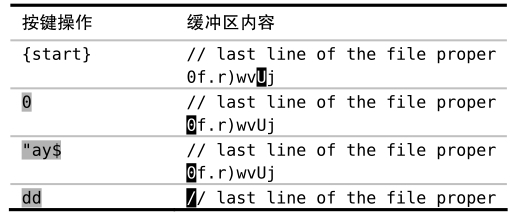

我们已经在上一个技巧中看到，在宏的结尾添加命令非常容易。但我们如果想删除宏的最后一条命令或者在宏的开头改点什么东西，该怎么办呢？在本节中，我们将学习如何像编辑普通文本一样编辑宏的内容。

注：目前 VSCodeVim 还不支持此功能，可以编辑，但写入寄存器后不生效，了解即可

## 问题：非标准格式

假设我们已经遵从录制工作单元中的步骤，将所有按键操作保存至寄存器 `a` 了。接下来，我们要处理以下文件，它与之前的文件相比，在格式上略有差异：

有些文本行已经使用了大写字母，而有些行还用的是小写字母。我们在之前的宏中使用 `~` 命令切换光标所在处的字母大小写（参见:h~）。而这一次，我们用新命令 `vU` 替换 `~` 命令，它会把光标处的字母变为大写（参见:h v_U）。

## 宏中的键盘编码

在本例中，我们用的是一个相对简单的寄存器。但如果我们试着编辑一个很大的宏时，事情很快会变得一团糟。举个例子，以下是录制的宏：

➾:reg a

《 --- Registers ---

"a Omoul<80>kb<80>kbdule Rank^[j>GGoend^[

注意到有什么奇怪的地方了么？首先，符号 `^[` 出现了好几次。不论你按的是 `<Esc>` 还是 `<C-[>`，Vim 都用 `^[` 表示 ESC 键。

更蹊跷的是代表退格键的符号 `<80>kb`。分析一下这组按键操作。在刚开始录制这个宏的时候，我输入的是“moul”，但当我发现错误后，又按了几下退格键，随后又输入了单词余下的部分“dule”。

这个动作没什么实际效果。如果我回放这些按键操作，Vim 将依次重现我的犯错与改正过程。尽管最终的结果是正确的，但这的确让寄存器的内容难于阅读，而且编辑起来会更复杂。

## 将宏粘贴到文档中

用于录制宏的寄存器，与用作复制、粘贴操作的寄存器是一样的。因此，如果我们想修改寄存器 `a` 中的宏的话，只需将其粘贴至文档中，便可以像编辑普通文本一样编辑它了。

首先，我们按 `G` 键，跳到当前文档的结尾，目的是要把寄存器 `a` 中的内容粘贴至新的一行。处理这种情况最简单的方式是用`:put` 命令：

➾:put a

为什么不直接用 `"ap` 命令呢？因为，在本例的上下文中，`p` 命令会把寄存器 `a` 的内容粘贴至当前行的光标之后。而 `:put` 命令总会将它们粘贴至当前行的下方，无论寄存器保存的是面向行的还是面向字符的文本块。

## 编辑宏

现在我们可以像编辑普通文本一样编辑宏了。将 `~` 替换为 `vU`。

## 将宏从文档复制回寄存器

我们已经得到了一组命令序列，它看上去正是我们想要的样子，因此，我们可以将其从文档复制回寄存器。最简单的方式就是运行 `"add`（或者 `:d a`），但这么做可能会在以后导致问题。`dd` 命令将执行面向行的删除操作，因此，寄存器会包含一个拖尾字符 `^J`：

➾:reg a

《 0f.r)wvUj^J

该字符表示一个换行符，且在大多数情况下，该字符都无关紧要。但有时这个拖尾字符可能会改变宏的意义。为了保险起见，用面向字符的复制操作把这些字符从文档复制回寄存器会更安全：

我们依次运行命令 `0` 以及 `"ay$`，将把该行除回车符之外的每一个字符都复制下来。在把宏的内容保存回寄存器 `a` 之后，我们就可以用 `dd` 删除这一行了。尽管删除的内容最终将被保存到缺省寄存器，但我们也不会用到它们。

做完以上这些步骤，当前寄存器 `a` 中保存着一个新的、改进的宏。我们可将其用于本节刚开始的示例文本。

## 结论

能够将宏粘贴到文档，进行编辑，然后复制回寄存器中执行，这样做的确方便。但出于宏中的键盘编码所罗列的诸多原因，使用寄存器得特别谨慎。如果你只需将一条命令附加于宏的结尾，那么，按照上一个技巧中所列的步骤会更简单。
