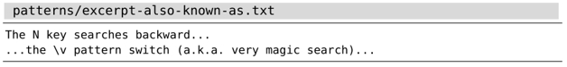
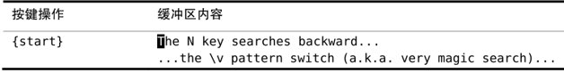
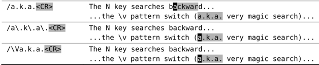

目前 VSCodeVim 还不支持此功能，就简单介绍一下

在正则表达式中，某些符号具有特殊含义，而不是其本身的含义

但 Vim 缺省使用 magic 搜索模式，即这些符号就是其本身含义，要使用其特殊含义，需要转义一下

## 按正则表达式查找时，使用 \v 模式开关

我们可以利用 `\v` 模式开关来统一所有特殊符号的规则。该元字符将会激活 very magic 搜索模式，即假定除\_、大小写字母以及数字 0 到 9 之外的所有字符都具有特殊含义（参见:h \v）。

比如我们要匹配 css 颜色代码：我们需要匹配 1 个 # 字符以及紧随其后的 3 个或 6 个十六进制字符（包括所有数字以及大写或小写的字母 A 到 F）。

下面的正则表达式将满足这些需求：

`➾/#\([0-9a-fA-F]\{6}\|[0-9a-fA-F]\{3}\)`

尽管这个正则表达式能够完成任务，但你看看这些反斜杠，竟有 5 处之多！

在此例中，我们用到了 3 类括号。方括号缺省具有特殊含义，因此不用转义。圆括号会按原义匹配字符 (及)，因此需要转义，使其具有特殊含义。花括号也一样需要转义，不过，我们只需为开括号转义，而与之对应的闭括号则不用，因为 Vim 会推测我们的意图。圆括号的情况有所不同，无论开闭括号都必须转义。

这一次，让我们使用 `\v` 模式开关，来重写那个匹配十六进制颜色代码的正则表达式：

`➾/\v#([0-9a-fA-F]{6}|[0-9a-fA-F]{3})`

由于出现在起始位置的 `\v` 开关，位于它后面的所有字符都具有特殊含义。这样一来，那些反斜杠字符就可以去掉了，可读性是不是更强了？

我们可以进一步优化这个模式，在拼写时，用字符类 `\x` 代替完整的字符集 `[0-9a-fA-F]`（参见:h/character-classes）。以下模式等同于前面的那个：

➾/\v#(\x{6}|\x{3})

最后说明一点：字符 `#` 没有特殊含义，因此可按原义匹配。还记得 very magic 搜索模式是把除\_、字母和数字以外的所有字符都当作具有特殊含义的字符吗？看样子我们已经发现了该规则的一个特例。

对于这个问题，Vim 的解释是任何还未具有特殊含义的字符都被“保留以备将来扩展时使用”（参见:h /\\）。换句话说，尽管 `#` 目前不具有特殊含义，但不意味着将来的版本也会这样。万一将来 `#` 被赋予了特殊含义，我们必须要将其转义后，才可以匹配“#”字符本身。

## 按原义查找文本时，使用 \V 原义开关

在正则表达式中使用的特殊字符，在按正则模式查找时用起来很顺手，但如果我们想按原义查找文本时，它们就变成了阻碍。使用 very nomagic 原义开关，可以消除附加在 .、\* 以及？等大多数字符上的特殊含义。

来看一下这段文本：

现在假设我们想通过查找“a.k.a.”（此缩写表示 also known as）的方式将光标移到该处。针对这种情况，第一反应就是执行以下这条查找命令：

➾/a.k.a.

但当我们按下回车键时，会发现此模式所匹配的内容比我们预想得要多。这是因为，符号“.”具有特殊含义。它匹配任意字符，而单词“backward”的部分内容又恰好可以匹配该模式。下表展示了查找的结果。

我们在本例中遇到的麻烦还不算大，因为只需按一下 `n` 键，我们就可以跳到下一处匹配——真正的目标。但在有些情况下，如果某个匹配被误判为正确，可能会有潜在的风险。想象一下，如果我们还没意识到查找模式太宽泛了，就接着运行了 substitute 命令，例如，`:%s//also␣known␣as/g`（正如在 [Vim 技巧 - 把当前单词插入到命令行](/pages/e88e82/)所讨论的那样，若将:substitute 命令的查找域留空，Vim 将使用上一次的查找模式），会导致某些意想不到的错误发生。

我们可以用转义的方法消除 . 字符的特殊含义。以下模式不会匹配单词 backward 中的一部分，但仍然会匹配“a.k.a”：

`➾/a\.k\.a\.`

或者，我们可以使用原义开关\V，激活 very nomagic 搜索模式：

`➾/ \Va.k.a.`

正如 Vim 帮助文档所述，“使用 "\V"会使得其后的模式中只有反斜杠有特殊的意义”（参见:h/\V）。这样做未免过于简化了，但却符合本例的目的。

在 very nomagic 搜索模式下创建正则表达式也不是不可能，不过会很别扭，因为我们必须为每个符号转义。作为通用法则，如果你想按正则表达式查找，就用模式开关\v，而如果你想按原义查找文本，就用原义开关\V。

## 历史课堂：Vim 模式语法的传承

对于 Vim 的模式来说，除了由 `\v` 与 `\V` 开关使能的语法外，还有两种更为古老的语法。Vim 缺省使用 magic 搜索模式，而 nomagic 模式则用于模拟 vi 的行为，我们可以通过 `\m` 与 `\M` 开关，来分别使能这两种语法。

`\M` 作为 nomagic 搜索模式的开关，其功能类似于 `\V` 原义开关，不同的是，一些字符会自动具有特殊含义，即符号 `^` 与`$`。

magic 搜索模式会自动为某些额外的符号赋予特殊含义，例如：.、\*以及方括号。magic 模式的设计初衷，是想能更容易地构造简单的正则表达式，但它却没能为诸如 +、？、圆括号以及花括号等符号赋予特殊含义，这些符号还必须经过转义才具有特殊含义。

magic 搜索模式旨在让构造正则表达式变得容易，但却半途而废，导致对于哪些字符需要转义的规则制定得比较混乱，难以记忆。`\v` 模式查找开关正好弥补了这一点，除了 \_、数字以及字母外，它为所有符号都赋予了特殊含义。这样一来，既好记又恰好与 Perl 正则表达式的规则保持一致。
