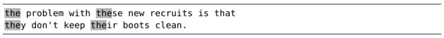

在我们定义模式时，如果能指定单词从哪里开始到哪里结束的话，将会非常有用。Vim 的单词定界符可以帮助我们做到这一点。

有些单词，尤其是短词，常常出现在其他单词内部。比如，“the”就会在“these”、“they”、“their”等单词中出现。因此，如果我们在下面这段文本中执行 `/the<CR>` 进行查找的话，会发现实际匹配的内容比我们预想得要多。

如果我们想明确匹配“the”这个完整的单词而不是其他词的组成部分，可以使用单词定界符。用 `\<` 与 `\>` 符号表示单词定界符。因此，如果我们将查找命令改为 `/\<the\><CR>` 的话，文中就只会出现一处匹配了。

VSCodeVim 还支持使用 `\b` 代替 `\<` 与 `\>`，当然，从技术上讲，这并不完全正确，但从书写上来讲，确实比较方便了一些

这些就是所谓的零宽度元字符，它们本身不匹配任何字符，仅表示单词与围绕此单词的空白字符（或标点符号）之间的边界。

即使我们还没养成用单词定界符构造查找模式的习惯，但每当我们使用 `*` 或者 `#` 命令（参见:h \*）时就会间接地用到它们。这两条查找命令分别用于正向或反向查找光标下的单词。假设我们刚刚用过这两条命令中的某一个，在查看查找历史（按 `/<UP>`）时就会发现，上一次的查找模式就被单词定界符围在中间。顺便说一句，`g*` 与 `g#` 这两种变体将执行同样的查找，但不会使用单词定界符。
