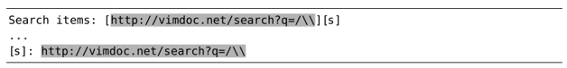

`\V` 原义开关使得按原义查找文本变得更容易，因为符号.、+以及*的特殊含义被屏蔽掉了。但还有一些字符，其特殊含义无法被屏蔽。本节作为高级技巧，将研究如何处理这些字符。

## 正向查找时要转义/字符

以下文本摘录自一篇 Markdown 文档（实际的 URL 为 vimdoc.sourceforge.net(3)，此处为了适应版面的需要，将其缩写为 vimdoc.net）：


假设我们想找到所有出现过 URL `http://vim-doc.net/search?q=/\\` 的地方。我们不必手动输入这些内容，只需将其复制到某个寄存器，然后再粘贴到查找域即可。由于我们想精确地匹配这段文本，因此要使用 `\V` 原义开关。

只要我们的光标位于方括号之中，就都可以使用命令 `"uyi[`（为了方便记忆，用 u 表示 URL）将此 URL 复制到寄存器 u。然后我们输入 `/\V<C-r>u<CR>`，即可将此寄存器的内容填充至查找域了。最终的查找提示符类似于这样：

`➾/\Vhttp://vimdoc.net/search?q=/\\`

当我们执行此查找命令时，会得到以下结果：



这到底是怎么回事？当我们把完整的 URL 粘贴至查找域后，Vim 却把首次出现的符号 / 解析成了查找域结束符（参见查找域结束符）。因此，所有位于首个正斜杠之后的内容都被忽略掉了，所以我们的查找字符串仅剩下了 http:。

当进行正向查找时，我们必须要转义符号 /。而且无论执行的是 very magic 查找（使用模式开关\v）还是 very nomagic 查找（使用原义开关\V），都需要转义。让我们修正一下之前的查找命令，为每个 / 加上反斜杠前缀：

`➾/\Vhttp:\/\/vimdoc.net\/search?q=\/\\`

这一次查找的结果与我们预期的更为接近了：



但还不算完美，因为匹配的结果缺少了最后一个反斜杠。我们将很快揭晓其中的奥秘，但是首先，让我们考虑一下反向查找吧。

## 反向查找时要转义？号

当执行反向查找时，符号 ? 会被当作查找域的结束符。这意味着我们不必转义符号 / 了，但要对符号 ? 进行转义。

注意：如果我们对从寄存器 u 复制而来的 URL 进行反向查找时，会发生什么事情。

`➾?http://vimdoc.net/search?q=/\\`

在没有转义任何内容之前，Vim 将匹配字符串“http://vimdoc.net/search”：


这个结果比未转义过的正向查找要好多了，但仍未匹配完整的 URL。如果我们将？号加上反斜杠前缀，会得到更好的结果：

`➾?http://vimdoc.net/search\?q=/\\`

以下是新的匹配结果：



## 每次都要转义符号 \

在查找域中，还有一个字符需要转义，即反斜杠。通常情况下，一个\的出现预示着紧挨着它后面的字符将会得到某种特殊对待。如果我们将其加倍，变为 `\\` 后，前者则会消除后者的特殊含义。实际上是让 Vim 查找一个反斜杠。

在我们的示例文本中，要查找的 URL 包含两个连续的反斜杠，因此，我们必须在查找域中为每个反斜杠各添加一个反斜杠。在正向查找中，我们最终得这样：

`➾/\Vhttp:\/\/vimdoc.net\/search?q=\/\\\\`

完工！查询条件终于匹配了整个 URL：



无论我们采用的是正向还是反向查找方式，反斜杠字符永远都需要转义。

## 查找域结束符

你可能会觉得奇怪，为什么查找域会把某个字符视为结束符呢？它为什么不把所有位于查找提示符之后的内容都纳入查找匹配呢？答案是如果在查找域结束符之后附加某些标志位，可以调整 Vim 查找命令的行为。例如，如果我们运行命令 `/vim/e<CR>`，光标将会移到每个匹配的结尾，而非起始。在以后的技巧中，我们将学习如何利用此功能，而不是被其左右。
