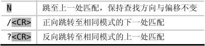

本节将涵盖查找命令的基础知识，包括怎样指定查找的方向，如何重复（或反向重复）上一次查找，以及怎样使用查找历史。

## 执行一次查找

在普通模式下，按下 `/` 键会调出 Vim 的查找提示符，可在它的后面输入要查找的模式或者原义文本。另外，只有当我们按下 `<CR>` 键时，Vim 才会执行查找命令，而如果换用 `<Esc>` 键的话，查找提示符会消失，我们将重回普通模式。

当我们执行一次查找时，Vim 会从当前光标位置开始向下扫描，停在所找到的第一处匹配上。如果 Vim 扫描到文档结尾仍未找到目标，会提示“已查找到文件结尾，再从开头继续查找”，这意味着在某些情况下，一次正向查找反而把我们带到了查找起点之前。尽管听上去有点让人困惑，但只要记住查找命令抵达文档结尾处时会回绕至文档开头继续查找，这就说得通了。

如果你只想在当前光标位置至文档结尾的范围内查找，而不想绕回文档继续查找的话，可以关闭‘wrapscan’选项（参见:h 'wrapscan'）。

## 指定查找的方向

当我们使用 `/` 键执行一次查找时，Vim 将进行正向扫描。而如果是用 `?` 键调出查找提示符的话，Vim 则会进行反向查找。查找提示符始终以 `/` 或者 `?` 字符开头，表明此次查找的扫描方向。

## 重复上一次查找

`n` 命令用于跳转到下一处匹配，而 `N` 命令则用于跳转到上一处匹配。通过 `n` 与 `N` 这两条命令，我们可以方便地在各个匹配之间往来穿梭。但“下一处匹配”的定义取决于上下文环境。

`n` 命令既会保证查找方向不变，又会使查找的偏移与上一次保持一致。因此，如果我们用 `/` 执行一次正向查找，`n` 将继续向下查找；而如果最初的查找命令是 `?` 的话，`n` 将继续向上查找。同时，`N` 命令将始终与上一次查找的方向保持相反。

有时候，我们也许想重复查找同一个模式，但要改变查找的方向或偏移。在这种情况下，如果我们知道不提供模式而直接执行查找时，Vim 将重用上一次查找的模式的话，将会对我们大有裨益。下表总结了用于重复一次查找的选项：

假设我们使用 `?` 开始一次查找，并已经跳到了上一处匹配，但是我们改主意了，决定向下跳转至其他匹配。当然，我们可以通过 `N` 键做到这一点，但这好像把一切都搞得上下颠倒了。除此之外，也可以执行 `/<CR>`，即用相同的模式执行一次正向查找。这样一来，我们就可以使用 `n` 键遍历文档中余下的匹配了。

## 回溯之前的查找

Vim 会一直记录我们执行过的查找模式，因此可以方便地重用它们。当查找提示符出现时，我们可以通过 `<Up>` 键，滚动浏览之前的查找记录。实际上，浏览查找历史与浏览命令行历史的接口完全一致。
