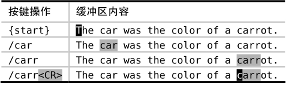

激活了增量查找功能之后，将使得 Vim 的查找命令如虎添翼。该选项可在以下几个方面来改善工作流程。

未激活情况下，我们在输入查找模式时，Vim 不会进行查找，只有当我们按下 `<CR>` 后，它才会立即展开行动。‘incsearch’是我最喜爱的增强型功能（参见:h 'incsearch'）。该设置会让 Vim 根据已在查找域中输入的文本，预览第一处匹配。每当我们新输入一个字符时，Vim 会即时更新预览内容。下表展示了它的工作原理：

当我们在查找域中输入“car”之后，Vim 会把第一处匹配高亮起来，即本例中的单词“car”。一旦我们继续输入字符“r”，由于当前的高亮单词不再匹配这一模式，因此，Vim 将跳转到下一个匹配的单词，这一次是“carrot”。如果此时我们按下 `<Esc>` 键的话，查找提示符将会消失，光标也将回退到位于行首的起始位置。但如果按 `<CR>` 执行这条命令的话，光标会跳转到单词“carrot”的首字母上。

这种即时的反馈体验让我们了解到何时已经找到目标。如果我们只是想简单地将光标移至单词“carrot”的起始位置，则大可不必在查找域输入完整的单词，因为在本例中，`/carr<CR>` 就足够了。但如果没有激活‘incsearch’功能，除非真正地执行查找命令，否则，对于模式是否已经匹配到了目标，我们将无从知晓。

## 检查是否存在一处匹配

在我们的例子中，两处部分匹配“car”的单词恰巧在同一行。但试想一下，如果单词“car”与“carrot”被几百个单词所隔开，一旦我们在查找域中将“car”更新为“carr”，Vim 将不得不对文档进行滚动才将单词“carrot”显示出来。事实的确如此。

假设我们只想确认单词“carrot”是否在当前文档中出现，却不想移动光标，该怎么办呢？当‘incsearch’选项被启用时，我们只需简单地调出查找提示符，并尽可能多地输入组成单词“carrot”的字符，直到该单词首次映入我们的眼帘。一旦找到该单词，我们只需按下 `<Esc>`，即可马上结束查找并返回原位，从而避免打断我们的思维。

## 根据预览结果对查找域自动补全

在最后一个例子中，我们在完整输入单词“carrot”之前就执行了查找命令。如果我们是想把光标简单地移动到第一处匹配上的话，这样做就很好了。但假设我们想让模式匹配完整的单词“carrot”，例如，我们打算在查找命令之后执行一条 substitute 命令，该怎么办呢？

当然，最简单的方式是完整的输入“carrot”，但这里介绍给大家一个好用的快捷键 `<C-r><C-w>`。此法会用当前预览的匹配结果对查找域进行自动补全。如果我们已在查找域中输入了“carr”，执行该命令会将“ot”添加到结尾，使其最终匹配完整的单词“carrot”。

注意，`<C-r><C-w>` 自动补全功能在处理以下场景时略有瑕疵，即一旦在查找内容中加入元字符 `\v` 前缀，`<C-r><C-w>` 会把光标下的完整单词，而不是单词的余下部分，作为补全的内容（例如，执行补全后会变成 `/\vcarrcarrot<CR>`）。因此，只要你找的不是模式，而是单词或词组，基于增量查找的自动补全功能真地能节省一点时间。

注：VSCodeVim 目前不支持此功能，输入 `<C-r><C-w>` 自动补全的是光标下的字符，而不是当前匹配的字符
