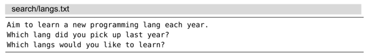
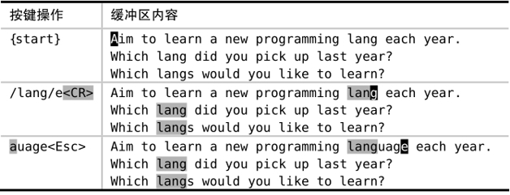
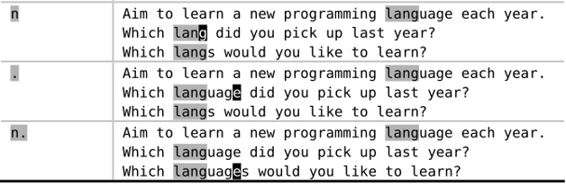

我们可用查找偏移把光标定位于距离某个匹配的起始或结尾一定步长的位置。在本节中，我们将通过一个例子，研究如何将光标定位于匹配的结尾，这样一来，我们就可以用点范式完成一系列的修改操作了。

每当我们执行查找命令时，光标总会被定位于匹配的首字母上。虽然这种缺省操作看起来比较合理，但我们可能有时更倾向于将光标定位于查找匹配的结尾。Vim 的查找偏移功能，可以将此想法变为现实（参见:h search-offset）。

让我们研究一个例子。在下段文本中，作者始终把单词“language”写成了缩写形式：

要怎样才能把所有出现“lang”的这 3 处地方扩展为完整的单词？一种方案是使用 substitute 命令，即 `:%s/lang/language/g`。但是，让我们看看是否可以用点范式作为另一种方案。我们可能会沿着这种思路学到些什么。

我们先不使用查找偏移功能处理此问题。首先，我们要找到需要修改的字符串 `/langCR>`，该命令把光标移到第一处匹配的起始位置。然后，我们输入 `eauage<Esc>`，即可在单词结尾添加新的内容。在某个单词的结尾添加文本是很常见的任务，你可以不假思索地把 `ea` 敲出来，就好像它们是一条命令似的。

现在，我们只需将光标移至正确的位置，后续工作交由 `.` 命令处理就可以了。通过输入 `ne.`，我们可以修改下一处“lang”。其中，`n` 表示跳转至下一处匹配的起始位置，`e` 负责将光标移至单词结尾，而 `.` 会补全单词所需的字母。这总共是 3 次按键操作，虽然没能达到理想的点范式，但至少完成了工作。

果真如此么？如果我们第二次执行相同的命令，即 `ne.`，结果却破坏了最后匹配的那个单词。你能找出问题所在么？最后一处匹配“lang”的地方实际上是“languages”的缩写（注意是复数形式）。因此，如果我们盲目地重复那个不太理想的点范式的话，将会得到一个不伦不类的“langsuage”。很明显，在这个场景中，如果能把光标移到匹配的结尾，而不是单词的结尾，那就完美了。

这一次，我们使用 `/lang/e<CR>` 进行查找，该命令会像我们期望的那样，将光标置于查找匹配的结尾。这样一来，每当我们使用 `n` 命令时，光标都会被定位于下一处查找匹配的结尾，让我们可以完美地使用 `.` 命令。可以说，查找偏移功能让我们得到了理想的点范式。

在实际使用过程中，查找偏移功能被派上用场的时机并不太好把握。假设我们一开始并没有用偏移执行查找命令，而是在敲了若干次 `n` 之后，才发现最好将光标移至匹配的结尾。亡羊补牢，犹未为晚。我们可以简单地运行 `//e<CR>`。当我们把查找域留空时，Vim 将重用上一次的查找模式，因此，该命令将使用偏移重复上一次查找。(注：目前 VSCodeVim 还不支持此功能)
