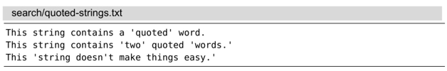
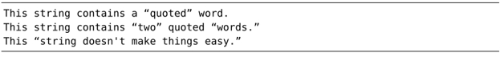
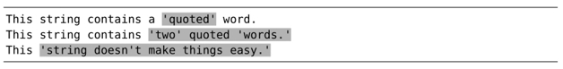
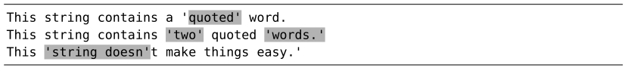

撰写正则表达式是一件很难的事情，因为我们不可能一次就写对。因此接下来要做的，就是总结一套顺畅的工作流程，允许我们通过迭代的方式逐步完成模式的设计工作。本节的巧妙之处在于如何从查找历史中回溯并编辑之前的记录。

在以下的示例文本中，单引号被当作引用标记：

我们要撰写一个正则表达式，用它匹配每一段被引号括起来的字符串。尽管这是一个需要多次尝试的过程，然而一旦匹配成功，我们便可以运行 substitute 命令将这些文本用真正的双引号括起来了，就像这样：


## 1.粗略匹配

首先，让我们进行一次粗略的查找：

➾ /\v'.+'

这个正则表达式会首先匹配一个'字符，然后匹配任意字符一次或多次，最终匹配另外一个'字符。执行完这条查找命令之后，我们的文档变成了下面这样：

第一行匹配正确，但第二行却出了问题。模式中的 `.+` 项执行了贪婪匹配，就是说它匹配了尽可能多的字符。但实际上，我们要在这行文本上得到两处独立的匹配，即每个括起来的单词都单独作为一处匹配。让我们修改一下之前的命令。

## 2.逐步求精

这一次，我们不用那个匹配任意字符的 `.` 符号，而是换成更具体的内容。实际上，我们要匹配的是除了'之外的任意字符，因此可以用 `[^']+`。改进后的模式将变成以下模样：

`➾ /\v'[^']+'`

我们不必重新输入完整的命令，只需按 `/<Up>`，查找域中便会出现上一次的模式。我们只需做一些小的改动，即用`<Left>` 以及退格键将 `.` 字符从模式中删掉，然后输入新的内容。

当我们执行查找时，将会得到以下匹配：

这一次有所进步。前两行匹配的内容正是我们想要的，但在第三行又出现新的问题。有一处被当作撇号使用的 ' 字符中断了匹配过程。因此，我们必须进一步改进模式。

## 3.精益求精

现在，我们需要考虑撇号与闭引号的区别到底是什么。有不少这样的例子，如“won't”、“don't”以及“we're”。每个示例中的'字符之后都紧跟着某个字母，而不是空格或者标点。因此，我们可以进一步修改模式。如果紧跟着'字符出现的是单词型字符，则前者也被当作普通字符处理。以下是新改进的版本：

`➾ /\v'([^']|'\w)+'`

这一次修改引入了一些相当有价值的内容。我们不仅额外增加了元字符 `'\w`，而且还将两种可选方案用括号括了起来并用竖线隔开。是时候让它大显神通了。

这一次，我们不是按 `/<Up>` 把上次的模式填到查找域，而是用 `q/` 调出命令行窗口。此窗口与一个常规的 Vim 缓冲区差不多，不过它的内容是查找历史，每行显示一条。这样一来，我们就可以使用 Vim 强大的区分模式的编辑能力来修正上次的模式了。

一旦得到了理想模式，我们只需按下 `<CR>` 键即可执行查找了。如下所示，文档中的匹配会被高亮起来：

太棒了！

注：VSCodeVim 使用 `q/` 只能调出查找历史，无法编辑

## 4.画上完美句号

我们的模式成功地完成了所有匹配，但在执行 substitute 命令之前，还需要进行最后一点修改，因为我们想捕获引号括起来的内容。以下是最终的模式：

`➾ /\v'(([^']|'\w)+)'`

我们既可以运行 `/<Up>` 并在查找域中编辑，也可以运行 `q/` 并在命令行窗口中修改。哪种方式用起来更顺手就用哪个。尽管这次查找的高亮结果与上次相比并无二致，但对于每一处匹配来说，引号所括的文本已经被赋给 `\1` 捕获寄存器了。这意味着我们可以运行以下 substitute 命令了：

`➾:%s//“\1”/g`

将查找域留空，Vim 将重用上一次的查找命令。以下是运行命令的输出结果：



## 结论

实际上，我们刚才所做的等同于如下命令：

`➾:%s/\v'(([^']|'\w)+)'/“\1”/g`

但是，你有信心一次就把这条命令写对吗？

不必纠结于一次就能写对查找模式。Vim 会保留最近一次的查找模式，只需两次按键操作即可引用它，因此，我们可以非常方便地对模式加以改进。先进行粗略的匹配，再一步步地接近你的目标。

对于简单的编辑任务，直接在命令行中编辑就很方便，如果启用了‘incsearch’选项，我们就会在编辑命令时看到实时反馈，这是一个额外的好处。
