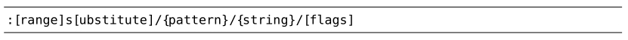
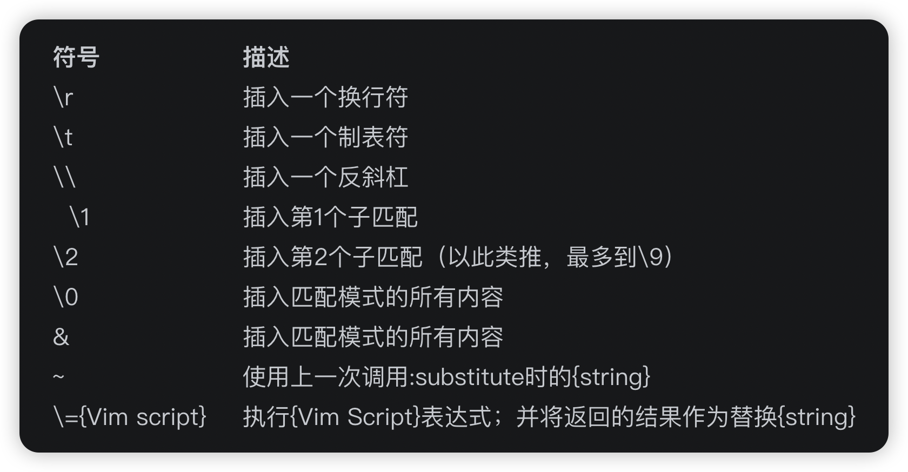

`:substitute` 命令很复杂，除了要提供查找的模式以及替换字符串外，还要指定执行的范围。另外，作为可选项，我们还可以通过标志位来调整该命令的行为。

substitute 命令允许我们先查找一段文本，再用另一段文本将其替换掉。命令的语法如下所示：

一条完整的 substitute 命令由许多部分组成。其中，`[range]` 的规则对于每一条 Ex 命令都适用，substitute 命令也不例外。

## 利用标志位调整 substitute 命令的行为

我们可以利用标志位来调整 substitute 命令的行为。要充分了解 substitute 标志位的作用，最佳的途径就是在实际应用中对其进行观察。因此，让我们简短地将其他技巧中用到的标志位在此处做一番总结。（关于完整的参考资料，请查询:h s_flags。）

标志位 `g` 使得 substitute 命令可在全局范围内执行，即可以修改一行内的所有匹配，而不仅仅是第一处匹配。

标志位 `c` 让我们有机会可以确认或拒绝每一处修改。

标志位 `n` 会抑制正常的替换行为，即让 Vim 不执行替换操作，而只是报告本次 substitute 命令匹配的个数。

当我们执行 substitute 命令时，如果在当前文件中没有匹配到该模式，Vim 会提示错误信息“E486:找不到模式”。标志位 `e` 专门用于屏蔽这些错误提示。

标志位 `&` 仅仅用于指示 Vim 重用上一次 substitute 命令所用过的标志位。

## 替换域中的特殊字符

在以前的技巧中，我们已经发现一些字符在用作查找模式时具有特殊含义。替换域中也有一些特殊字符。通过查询:h sub-replace-special，你可以找到完整的列表，下表只是总结了其中的一部分常用符号：

