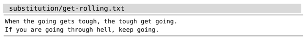
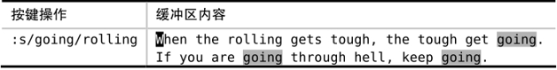
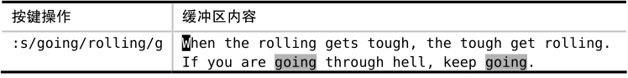
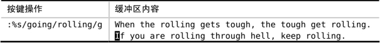

在缺省情况下，substitute 命令仅仅作用于当前行，而且只会修改第一处匹配。因此，为了在整个文件的范围内修改每一处匹配，我们必须指定范围，并使用标志位 `g`。出于演示的目的，我们将使用以下文本：


让我们试着将所有单词 going 替换为 rolling。

要使用 substitute 命令，最简单的方法就是为它提供待替换的模式{pattern}以及替换字符串{string}：



看看发生了什么。Vim 已经将第一处“going”替换成了“rolling”，但其他匹配的内容并没有发生改变。

要理解其中的原因，一种行之有效的方法就是将文件想象成二维平面，字符沿着 x 轴增加，而文本行则随着 y 轴向下增长。在缺省情况下，substitute 命令仅仅作用于当前行的第一处匹配。接下来看一看，如果要将替换范围扩大至由 x 与 y 轴所围的整个平面，我们都需要采取哪些措施。

为了使 substitute 命令作用于整个横轴，需要引入标志位 `g`。`g` 看似为全局之意（global），实则有误导之嫌。也许有人想借此标志位在整个文件范围内进行替换操作，但实际上，它仅表示“当前一整行范围”。如果你还记得我们在 Vim（及其家族）的词源中讨论过 Vim 直接继承自“行编辑器 ed”的话，这就能说得通了。

我们先按 `u` 键来撤销上次的修改，然后试着运行 substitute 命令的另一个版本。这一次，我们在命令的结尾附加标志位`/g`：


这一次，所有出现在当前行的 going 都被改成 rolling 了，但在文件的其他位置，仍有一些匹配未被修改。我们怎样才能控制 substitute 命令在整个文件的纵轴上执行呢？

答案是设定一个范围。如果我们在 substitute 命令的开头加上前缀 `%`，它就会在文件的每一行上执行了：


substitute 命令只是众多 Ex 命令中的一种而已，而对于所有的 Ex 命令，都可以用同样的方式为其指定一个执行范围。关于这一点，我们已在[技巧 - 在一行或多个连续行上执行命令](/pages/ae9b6d/)中做过深入的探讨，此处不再引申。

回顾一下，如果我们想在当前文件中查找并替换所有匹配，就必须明确地指示 substitute 命令要在整个 x 轴与 y 轴上执行，即凭借标志位 `g` 处理横轴字符的同时，使用地址符 `%` 处理纵轴的文本行。

在实际操作过程中，这些细枝末节往往让人顾此失彼。在后面的技巧中，我们将会见识几种用于重复 substitute 命令的技术。
