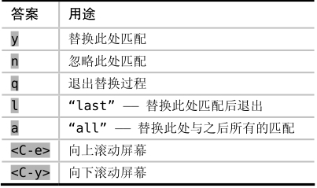

一次典型的替换过程包括先找到某个模式的所有匹配，再用其他文本进行自动替换。但是，此过程不总是那么令人满意。我们有时需要先观察每一处匹配，再决定是否进行替换。为了做到这一点，我们可以用标志位 `c` 控制 `:substitute` 命令的行为。

引入标志位 `c` 后，Vim 会对每处匹配结果提示“替换为 copy ?”，我们可以按 `y` 键，完成这次修改，或者按 `n` 键，跳过这一次修改。无论采用哪种方式，Vim 都会执行我们的决定，并移到下一匹配处再次提示。

当然，回应提示的答案不仅限于以上这两种。实际上，Vim 会体贴地为我们提示所有的选项“y/n/a/q/l/^E/^Y”。下表展示了每种答案的含义：


通过查阅:h :s_c，你也可以在 Vim 的帮助文档中找到以上信息。

不同于以往的是，在 Vim 的替换-确认模式下，键盘上的大多数按键都将失效。尽管 `<Esc>` 键可以让我们像往常一样回到普通模式，但除此之外，周围的一切都使我们感到陌生。

从积极的一面看，我们用最少的键盘操作就可以完成任务。从不利的角度看，我们习惯使用的功能键全都失效了。相比之下，如果使用点范式的话，我们自始至终都待在普通模式下，所有的一切都像我们期望的那样工作。

我的建议是两种方法都试试，哪种更顺手就用哪种。
