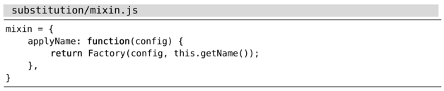

注：本文大部分功能 VSCodeVim 均不支持，只有 `s//~/` 支持

有的时候，我们可能要修正 substitute 命令的执行范围。原因多种多样，有可能是由于在第一次尝试运行 substitute 命令时犯了错，也有可能是我们想在另一个缓冲区中再次运行相同的命令。我们可以利用一些快捷方式更容易地重复 substitute 命令。

## 在整个文件范围内重复面向行的替换操作

假设我们刚刚执行完以下命令（其作用范围为当前行）：

➾:s/target/replacement/g

突然，我们意识到了失误，应该加上前缀 `%` 才对。幸好该命令没有造成什么不良后果。

接下来，我们只需输入 `g&`（参见:h g&），即可在整个文件的范围内重复这条命令。在效果上，它等同于以下命令：

➾:%s//~/&

这条命令可以详解为如下指令：用同样的标志位、同样的替换字符串、同样的查找模式以及新的执行范围 `%`，重复上一次 substitute 命令。换句话说，该命令表示在整个文件的范围内重复上一次替换操作。

当你下次再碰到某条 substitute 命令除了没加 `%` 前缀之外，其余都正确的时候，不妨试一试 `g&`。

## 修正 substitute 命令的执行范围

看一下这段代码：

假设我们想把它扩展成以下模样：

由于与现有的函数相比，新的 applyNumber 函数几乎没什么变化。因此，我们首先创建一份 applyName 函数的副本，然后用 substitute 命令将其中出现“Name”的地方改为“Number”。但下图所展示的操作流程有点问题。

你能发现问题所在么？由于我们采用符号 `%` 作为范围值，从而导致每一处“Name”都被改成了“Number”。这样做显然不对，我们应该指定一个范围，限定 substitute 命令只作用于第二个函数（副本）中的那几行文本才对。

不用担心。我们可以先简单地撤销一下，然后再进行修正

其中，`gv` 命令会激活可视模式，并重新将上次被选中的文本高亮起来。而当我们在可视模式下按输入 `:` 时，表示范围的 `'<,'>` 将被预先填充在命令行上，它限定了下一条命令只会在被选中的行上执行。

另外，我们需要解释一下 `&&` 命令，因为这两处 `&` 符号的含义有所不同。前一个 `&` 作为 Ex 命令 `:&` 的组成部分，用作重复上一次的 `:substitute` 命令（参见:h :&），而第二个 `&` 则会重用上一次 `:s` 命令的标志位。

## 结论

我们总是可以指定一个新的范围，并使用 `:&&` 命令重新执行替换操作。至于上次用的范围是什么并不重要。具体来说，`:&&` 命令本身只作用于当前行，`:'<,'>&&` 会作用于高亮选区，而 `:%&&` 会作用于整个文件。正如我们已经看到的那样，`g&` 命令作为 `:%&&` 的快捷方式，使用起来会更方便一些。

## 修正 & 命令

`&` 命令是 `:s` 命令的同义词，用于重复上一次的替换操作。遗憾的是，不论我们使用什么标志位，`&` 命令都将忽略它们，这意味着本次替换的结果可能与上一次截然不同。

让 `&` 来触发 `:&&` 命令会更有用，因为后者会保留标志位，从而使得执行命令的结果始终如一。以下映射项旨在修正普通模式下的 `&` 命令，并为可视模式创建一个类似的命令。

