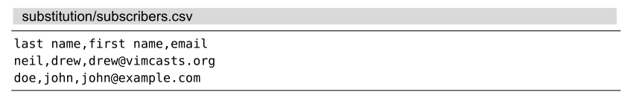
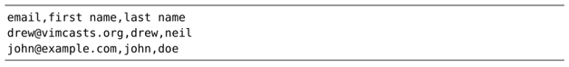

在本节中，我们将会看到如何从查找模式中捕获子匹配，并在替换域中引用它们。

假设有一个 CSV 格式的文件，其中包含了一份含有电子邮箱地址以及姓名的列表。

现在假设我们想交换这些字段的次序，即把电子邮箱放到首列，其次是名字，最后一列为姓氏。通过使用以下 substitute 命令，我们可以做到这一点：

`^([^,]*),([^,]*),([^,]*)$`

➾:%s//\3,\2,\1

在这个模式中，`[^,]` 会匹配除逗号以外的任何字符，因此，`([^,]*)` 不仅会匹配 0 次或多次连续的非逗号字符，而且会把捕获到的结果当作子匹配。将此表达式重复 3 次，即可分别捕获 CSV 文件中 3 组字段中的每一列内容。

我们可以通过记号 `\n(1)` 来引用这些子匹配。因此，在替换域中，`\1` 表示姓氏，`\2` 表示名字，`\3` 表示电子邮箱。在把一行内容切分成单独的字段后，我们可以把它们按照设想的顺序进行重新排列，即 `\3,\2,\1` —— 电子邮箱，名字，姓氏。

命令的运行结果如下所示：

