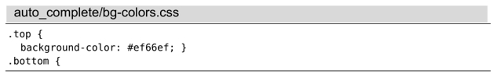
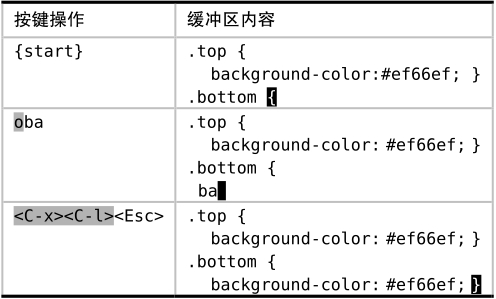

面向行的自动补全功能可以通过`<C-x><C-l>`（参见:h compl-whole-line）进行触发。

假设我们由这段文本开始：

我们想复制第二行内容并将其粘贴至文件的末尾。接下来，我将为大家介绍如何通过整行的自动补全功能来实现这一点

另外请注意，Vim 会忽略行首的缩进。

面向行的自动补全功能，妙就妙在我们不用知道要复制的行的具体位置，而只需知道有这样一行文本存在即可。想象一下，在输入了前几个字符后，当我们敲 `<C-x><C-l>` 时，哇塞！Vim 真地帮我们补全了余下的字符。

我们已经见识过另外两种通过寄存器（yyp）或 Ex 命令（用‘:t’命令复制行）实现复制整行文本的方法。这 3 种方法各有利弊。因此，我们要试着辨别这 3 种技术各自所擅长的场景，再相应地使用它们。
