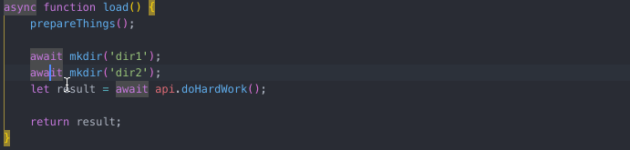

本文主要结合自己实际工作中的例子介绍重构插件 [JavaScript Booster - Visual Studio Marketplace](https://marketplace.visualstudio.com/items?itemName=sburg.vscode-javascript-booster)

由于该插件与 `Abracadabra` 有重复的功能，对此就不再详细介绍了，详情可参见 [Abracadabra](/pages/d6e84c/)

## Conditions: 条件

### Flip if-else: 翻转 if-else

使用快速修复：`Flip if-else`

### Remove redundant else: 删除多余的 else

使用快速修复：`Remove redundant else`

### Replace if-else with ?: 将 if-else 转换为三元

使用快速修复：`Replace with ?`

### Simplify if-else: 简化 if-else

使用快速修复：`Simplify if-else`

### Flip ?: 翻转三元

使用快速修复：`Flip ?`

### Replace ? with if-else: 将三元转换为 if-else

使用快速修复：`Replace ? with if-else`

### Simplify ?: 简化三元

使用快速修复：`Simplify ?`

### Merge nested if statements

使用快速修复：`Merge into one if-statement`

合并 if 语句

## Declarations: 声明

### Convert var/const to let: 将 var/const 转换为 let

使用快速修复：`Convert to let`

### Convert var to const: 将 var 转换为 const

使用快速修复：`Convert to const`

并不会判断 var 声明的变量是否改变

### Split into multiple declarations: 拆分为多个声明

使用快速修复：`Split into multiple declarations`

### Split into declaration and initialisation: 拆分声明并且初始化变量

使用快速修复：`Split into declaration and initialisation`

### Merge declaration and initialisation: 合并声明并且初始化变量

使用快速修复：`Merge declaration and initialisation`

## Strings: 字符串

### Replace string with template string: 转换为模板字符串

使用快速修复：`Replace with template string`

### Replace template string with regular string: 转换为字符串

使用快速修复：`Replace with regular string`

### Split string under cursor: 拆分光标下的字符串

使用快速修复：`Split string under cursor`

将光标下的字符串一分为二

### Trim whitespaces inside string: 修剪字符串内的空格

使用快速修复：`Trim whitespaces inside string`

去除字符串前后的空格

## Functions: 函数

### Convert shorthand arrow function to statement: 将速记箭头函数转换为语句

使用快速修复：`Add braces to arrow function statement`

当箭头函数的函数体只有一条执行语句并且会将其执行结果返回，我们一般省略大括号和 return，当我们想要执行多条语句时，就可以使用该功能添加大括号和 return

### Convert to shorthand arrow function: 转换为速记箭头函数

使用快速修复：`Convert to shorthand arrow function`

与上一条相反

### Add parens to single arrow function parameter: 为箭头函数的单一参数添加括号

使用快速修复：`Wrap parameter with ()`

当箭头函数只有一个参数时，一般都是省略括号的，但当我们想再加一个参数时，就可以使用该功能快速添加括号

### Convert function to arrow function: 将函数转换为箭头函数

使用快速修复：`Convert to arrow function`

### Convert arrow function to regular function: 将箭头函数转换为常规函数

使用快速修复：`Convert to regular function`

### Convert function declaration to arrow function: 将函数声明转换为箭头函数

使用快速修复：`Convert to arrow function`

## Async

### [on selection] Run selected await statements in parallel with Promise.all: 将选中的 await 语句使用 Promise.all 运行

使用快速修复：`Call in parallel with Promise.All()`

## TypeScript

### Convert enum to string-enum: 将枚举转换为字符串枚举

使用快速修复：`Convert to string enum`

### Convert string-enum to type union: 将字符串枚举转换为类型联合

使用快速修复：`Convert string enum to type enum`

### Convert type union of strings to string-enum: 将字符串的类型联合转换为字符串枚举

使用快速修复：`Convert type union to string enum`

## JSX / TSX

### Wrap value with {} (JSX attributes): 使用 {} 包裹 JSX 属性

使用快速修复：`Wrap value with {}`

### Remove {} from JSX attribute: 从 JSX 属性中移除 {}

使用快速修复：`Remove braces`

### Collapse/Expand empty tag: 折叠/展开空的标签体

使用快速修复：

- Collapse empty tag
- Expand empty tag

当标签体为空时，转换为自闭合标签，反之亦然

## React

### Wrap function into useCallback() hook: 使用 useCallback 包裹函数

使用快速修复：`Wrap function into useCallback() hook`

### React: Wrap component function with React.forwardRef(): 使用 forwardRef 包裹函数

使用快速修复：`Wrap component into React.forwardRef()`

### React: Wrap component function with React.memo(): 使用 memo 包裹函数

使用快速修复：`Wrap component into React.memo()`

### React: Convert function to React.FunctionComponent declaration: 将函数转换为 React 函数

使用快速修复：`Convert to React.FunctionComponent declaration`

