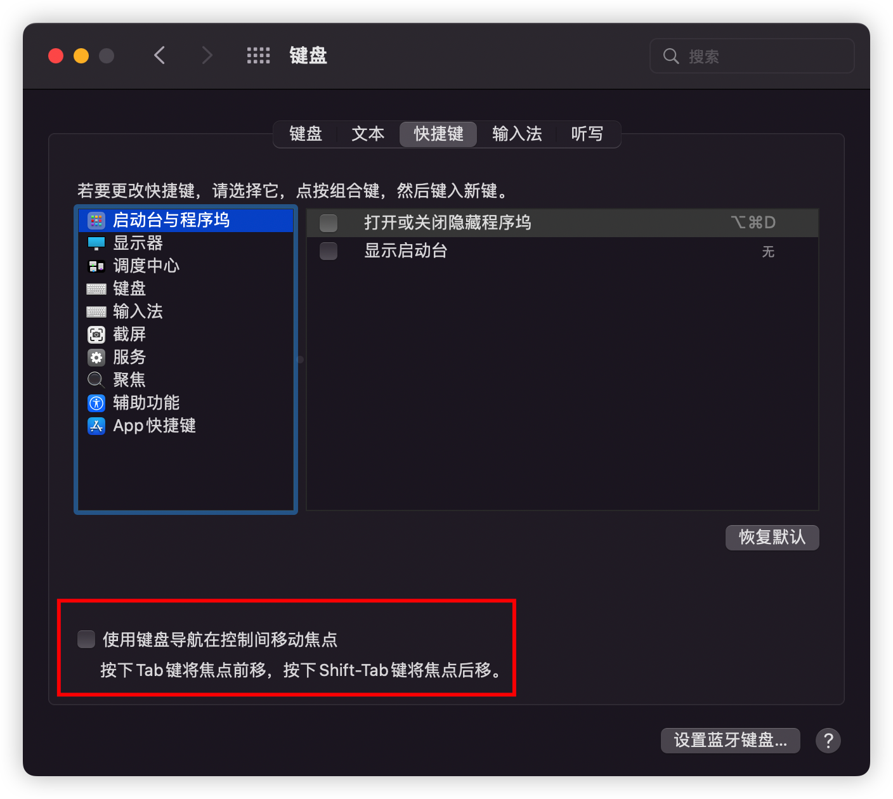

课程讲的 `chrome` 支持 `vim` 的插件是 `Vimium C`，而本人以前使用的是 `Surfingkeys`，感觉这个功能更多一点，大家可以根据自己喜好选择，文档也会把这两个插件的快捷键及配置都加上，方便大家选择，如无标注是哪个插件，则代表都通用

注：以下以简称来代表这两个插件：`VC` 代表 `Vimium C`, `SK` 代表 `Surfingkeys`

下载地址：

- [Surfingkeys - Chrome 网上应用店](https://chrome.google.com/webstore/detail/surfingkeys/gfbliohnnapiefjpjlpjnehglfpaknnc)
- [Vimium C - 全键盘操作浏览器 - Chrome 网上应用店](https://chrome.google.com/webstore/detail/vimium-c-all-by-keyboard/hfjbmagddngcpeloejdejnfgbamkjaeg)

[如何使用键盘把输入焦点从地址栏移到页面上](https://brookhong.github.io/2018/11/18/bring-focus-back-to-page-content-from-address-bar-cn.html)

可能由于 mac 系统版本不同，上面链接说的设置见下图，图中 checkbox 不勾选即可

但这样就无法使用 [Tab 键切换对话框的焦点](/pages/a52b6f/)，各有利弊吧
#

