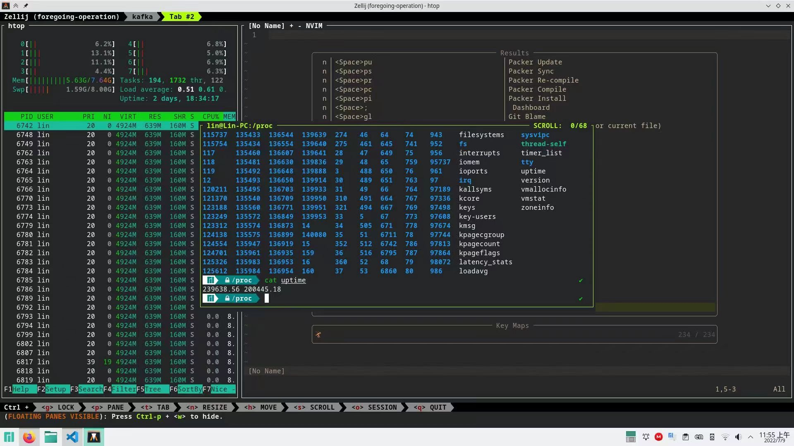
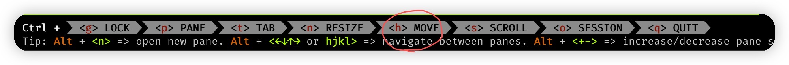
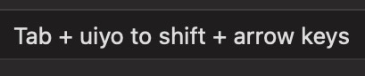
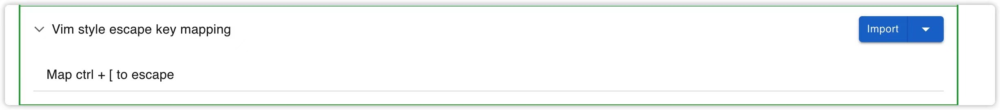
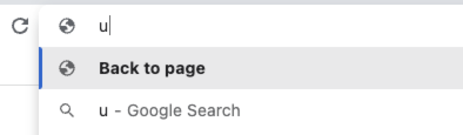

## 任务点

### 进入文本框选择模式

VC:

- gi: 进入文本框选择模式；当有多个时，默认聚焦第一个，使用 tab 切换

SK:

- i: 进入文本框选择模式；当有多个时，会类似 f，输入对应的字母聚焦该文本框
- I: 选择文本框，并打开 VIM 编辑器

### 复制当前标签⻚网址

- yy

VC:

- p: 在当前标签页打开复制的网址
- P: 新建标签页访问复制的网址

### 复制当前标签页

- yt

### 关闭当前标签页

- x

### 恢复最近关闭的网页

- X

### 刷新当前标签页

- r

### 选择文字

VC:

- yv: 进入可视模式，并全选指定文本
- V: 选择文字，对齐到行
- y: 复制选择的文字

[改键](https://github.com/gdh1995/vimium-c/wiki/Use-in-another-keyboard-layout)：

```
mapkey <L:v> <$>
mapkey <H:v> <0>
```

SK:

- zv: 进入可视模式，并全选指定文本
- v: 进入可视模式，通过屏幕中的字母选择位置后，需要再按一次 v 才能选择
- y: 复制选择的文字

改键：

```
api.vmap('L', "$");
api.vmap('H', "0");
```

### 取消选择并退出可视模式

- 两次 esc: 第一次取消选择，第二次退出可视模式

SK 独有：

- v

## 社群讨论

zellij 好用，还支持浮动窗口



这是啥

类似 tmux 那种 不知道怎么称呼

感受比  tmux   好用点

是啊，学习成本也低

我已经迁移过来了，感觉文档都没看已经能上手了

是的 还有个浮动窗口 挺不错的

这个东西也是有坑的。。改键 它还分字母的，有的字母有效果 有的没效果 试了 n 个之后才 ok

还能改键吗。。我没改，默认感觉就行

移动的话 和 ctrl h 冲突了

我用的 alt + 方向键



是这个，hhkb 只有一个 左 ctrl

我的没有冲突 能正常用 不知道为啥，移动 pane

ctrl h 被映射成 ← 了呀

我用的 tab。。tab+hjkl

你没改 ctrl hjkl 到方向键的话 就没这问题

我发现 ctrl 快键键多 就用 tab 习惯了

咦  tab 确实也不错

tab 1-0 我还映射成 f1-12 了



那这个也可以习惯习惯了

这是什么骚操作？shift + arrow

不然加 shift 的操作的话 会很难受。问题在 用 tab +  jkhl 的话   那么 上 shift 的话 按起来就不舒服了，所以变成 tab + uiyo 来映射成 shift + 方向键

ctrol + tab + hjkl 还行，shift 就不好按

是滴，所以这个映射 思路还挺 nice 的

把右边 command 映射成 super key，可以搞更多快捷键

所以改键还是 SpaceFN 最好

<hr />

当有多个滚动条时如何切换滚动区域呢？

用 f 聚焦，f 后，红色的文字可以切换滚动区域，黑色的是跳转

<hr />

有个问题，要不要把 ctrl + [ 映射成 esc

这样不仅仅在 vim 在可以用这个组合键 在任何场景都可以用了

这个还真可以，不然有的时候按 Ctrl [ 有的时候 esc

因为我发现 vimium c 的 ctrl + [ 有时退出不太灵光，改了映射我就可以在所有地方都这样退出了

这个改的话 就系统级别的改



karabiner 就搜这个可以了

可以，万物皆可 ctrl [

这个问题我们其实初始就说过了，可以看[这里](/pages/b62f25/)

<hr />

vimiumc 怎么退出地址栏 input 呀

[如何使用键盘把输入焦点从地址栏移到页面上](https://brookhong.github.io/2018/11/18/bring-focus-back-to-page-content-from-address-bar-cn.html)，见[说明](/pages/a8daa5/)

https://vim.nauxscript.com/chrome/day-31.html 昨天的笔记我有提到这个，目前找到的最优解

你这个改法不会导致在地址栏里输不了 u 么

hhh，虽然说的确。你可以换成一个你觉得用不到的。不过搜单个字母的可能也不大，不行你加个。号之类的也行。而且你都用插件了，直接按 o，里面搜不就好了

实测了一下并不会，效果是这样的



为啥 javascript: 会回到页面？

可能是地址栏回车会跳转页面，并且光标会移动到跳转后的页面那里。然后发现执行 javascript:;浏览器不会识别成网址。但是跳转的动作还是做了，所以又回来了。

应该就是这么个意思

这个方法有个不方便的点是必须要把地址栏清空后才能使用

Cmd + Option + Up / Down 可离开地址栏

可是去不了页面，我试过了

我试了可以啊，只是我键盘布局，按这些键需要 4 个，我还是用 u 快一点

哦 按两下

不用地址栏  就没这些烦恼了

地址栏的部分 o 替代就好，只是防止不小心     进去了

不是可以直接打开面板搜索吗，用昨天讲的功能就没这些烦恼了

<hr />

有没有人发现 vimium-c 文本选择模式下那个 H 的映射是无效的

分时候   是功能的问题   你换成按 0 一样的，映射没问题
