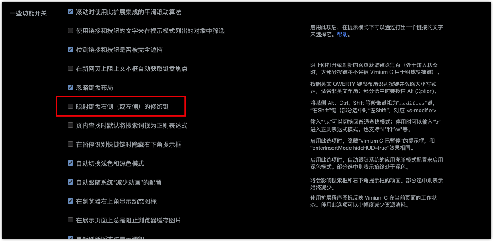

## 任务点

### 创建一个标记

VC:

- m: 在当前页创建一个滚动位置标记
- `: 跳转到指定标记

只在当前页面生效。比如在当前页面当前位置使用 `mm` 创建一个标记，滚动到别的位置，可以使用 \`m 使页面滚动到标记位置，切换到别的页面就不生效了

SK:

- m: 为当前 URL 设置类 vim 标示
- ': 访问类 vim 标签

跨页面生效，只能跳转到页面，不能滚动到标记位置。比如在当前页面使用 `mm` 创建一个标记，切换到别的页面，使用 `'m` 可以跳转回来；而当前页面滚动位置变化后，`'m` 会打开新页面

### 跳到当前地址的上一级

- gu

### 跳到当前地址的根路径

- gU

### 暂停插件

VC:

- i
- Esc: 恢复

SK:

- opt + s: 暂停/恢复

### 连续点击网⻚中的链接和按钮

VC:

- opt + f

SK:

- cf

### 从当前文本框移走键盘焦点或恢复

VC:

- F2: 移走或恢复

共有：

- Esc: 移走

## 社群讨论

有点奇怪，gU 跳转到首页，我用 g 左 shift + u 是不可以的，用 g 右 shift + u 可以

是不是中文输入法？

不是，找到原因了，不知道为什么开了这个，关掉就好了

