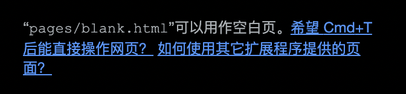

### 打开网页

VC:

- o: 在当前页打开
- O: 在新页签打开
- o + g + space: 使用 google 搜索
- o + b + space: 使用 baidu 搜索
- o + bi + space: 使用 bing 搜索
- o + gh + space: 使用 github 搜索

搜索结果通用翻页：

- page up: 上一页
- page down: 下一页

SK:

- go: 在当前页打开
- t: 在新页签打开
- oh: 在新页签打开历史记录
- og: 使用 google 搜索
- ob: 使用 baidu 搜索
- ow: 使用 bing 搜索

搜索结果通用翻页：

- ctrl + ,: 上一页
- ctrl + .: 下一页

### 收藏夹

VC:

- b: 显示搜索框并搜索收藏夹的内容
- B: 搜索收藏夹的内容并在新标签页打开

SK:

- b: 搜索收藏夹的内容并在新标签页打开

SK 能展示收藏夹的文件夹

### 编辑当前网址

VC:

- ge/gE: 当网址是一个搜索引擎时，是编辑搜索关键字；否则编辑当前网址

SK:

- ;u/;U: 用 VIM 编辑器编辑当前地址

### 在所有标签页中搜索

- T

### 查找

- /: 查找
- n: 查找下一个
- N: 查找上一个

SK 独有：

`/ + 搜索字符` 后，`enter` 是模糊搜索，`ctrl + enter` 是精准搜索; 比如 `/code`, `enter` 后 `vscode` 也可以被搜索到，而 `ctrl + enter` 就不会搜到

进入可视模式后，使用 `*` 可以搜索光标所在的单词，也可以使用 `f/F` 搜索，与 `vim` 原生一样，`f + 单字符` 搜索，`;/,` 重复搜索上/下一个

### 在 chrome:// ⻚面上运行

在 `chrome://flags` 页面搜索 `extensions-on-chrome-urls`，设置为 `Enabled` 即可

但是不建议，可能有安全问题

### 跳到第一个/最后一个标签页

- g0: 跳到第一个标签页
- g$: 跳到最后一个标签页

VC 独有：

`g0/g$` 可以和数字配合，切换到左/右起指定位置的标签页，比如要切换到左起第二个标签页，即可输入 `2g0`；

### 打开新标签页

VC:

- t

SK:

- on

### 复制当前标签页

- yt

SK 独有：

- yT: 在后台复制当前标签页

### 关闭当前标签页

- x

### 恢复刚关闭的标签页

- X

### 移动当前标签页到下一个窗口

- W

### 切换到最近使用的前一个标签页

VC:

- ^

SK:

- ctrl + 6

### 返回前一个标签页

SK:

- B

### 往后一个标签页

SK:

- F

### 往左/右移动当前标签页

- <</>>

可以配合数字移动

### 固定/解除固定当前标签页

- opt + p

### 创建一个标记

VC:

- m: 在当前页创建一个滚动位置标记
- `: 跳转到指定标记

SK:

- m: 为当前 URL 设置类 vim 标示
- ': 访问类 vim 标签

### 跳到当前地址的上一级

- gu

### 跳到当前地址的根路径

- gU

### 暂停插件

VC:

- i
- Esc: 恢复

SK:

- opt + s: 暂停/恢复

### 连续点击网⻚中的链接和按钮

VC:

- opt + f

SK:

- cf

### 从当前文本框移走键盘焦点或恢复

VC:

- F2: 移走或恢复

共有：

- Esc: 移走

### 打开/关闭开发者工具

- cmd + opt + i

### 打开 elements 控制台并默认打开选择元素按钮

- cmd + opt + c
- cmd + shift + c: 不仅可以打开控制台，再按还可以切换是否选择元素
- cmd + shift + m: 切换设备（web/app）

### 打开 console 控制台

- cmd + opt + j

### 切换控制台

- cmd + [/]

### 在其他控制台打开 console 控制台

- ctrl + `
- esc: 打开/关闭

### 清空 console 控制台

- cmd + k
- ctrl + l

### 搜索文件

- cmd + p

### 搜索命令

- cmd + shift + p

### 采用 vscode 的快捷键方式

`cmd + opt + i` 打开控制台，使用 `F1` 打开设置页面，切换到 `Shortcuts`，在 `Match shortcuts from preset` 设置为 `VSCode` 即可

设置好以后，`F1` 就变成搜索命令了，打开设置页面的快捷键是 `cmd + ,`

当然可以使用 `cmd + k cmd + s` 快速打开 `Shortcuts`

## 社群讨论

Chrome 在这种页面，无法使用 shift + o，有解决方案么

新标签页？

获取这个页面的 location.href，然后配置到  vimium-c 的新建标签页，或者看这个

下一个插件 然后配置一下

嗯

https://e.juejin.cn/#/   主页配成这个就好

我是下了一个插件

但是这样配的话你试一下用 cmd + t，会发现打开的是 google 的默认页面，如果你平时不用 cmd + t 来新建页面的话就没关系

t 够了

如果你像我一样是用默认的可以加这个插件

这个可以配置默认打开新标签页时的页面

Mac 有啥插件没有，切换 App 就回到英文输入法，每次切换，按了半天快捷键，原来拼音输入

搜狗就可以设置

我使用原生的苹果输入

SwitchKey

可以，这个 6。会记录 App 的输入法状态

系统默认就可以记录的吧我记得

我的是这样的

我的是搜狗拼音，我没有用自带的简体拼音输入法
