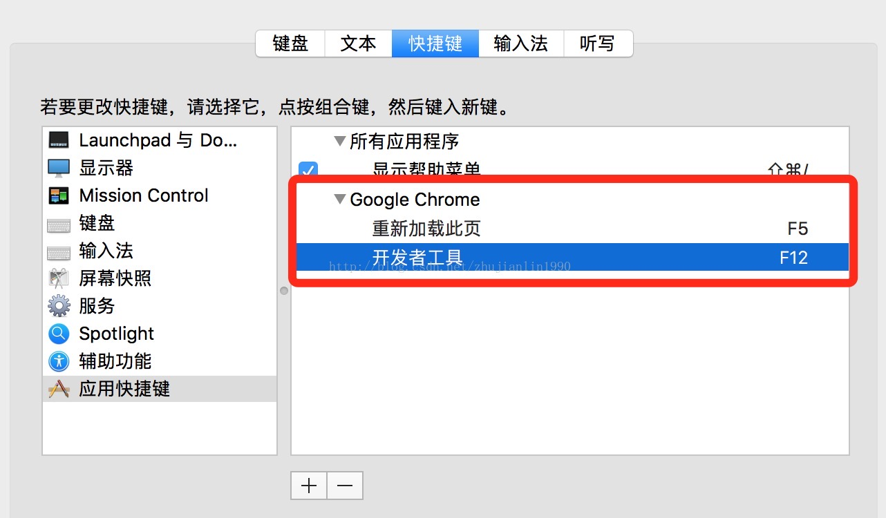

## 任务点

### 打断点

- cmd + b: 打开/关闭断点
- cmd + shift + b: 切换断点是否可用

### step over

- cmd + '
- F10

### step into

- cmd + ;
- F11

### 停止当前断点

- F5
- cmd + \

### 切换全部断点是否可用

- cmd + F8

### 输出选中的代码

- cmd + shift + e

### 跳转到函数

- cmd + shift + o

### 跳转到指定行

- ctrl + g

## 社群讨论

打开开发者工具，vimiu 就不行了，怎么处理的，关了开发者工具吗？

对，聚焦的概念 不然触发快捷键算谁的

f12 好远。可以这样改成想要的

vimiumc 肯定管不了开发者工具啦，有个方法聚焦回页面：cmd l 聚焦 地址栏，然后再从地址栏回到页面

这样不还得按 u 回车

对 cmd l 然后 u 然后 enter

我把 abc 输入法删了 [这个简单版](https://zhuanlan.zhihu.com/p/382382547) [这是详细版本](https://blog.zhheo.com/p/118e7ee0.html)

会不会影响开机输入密码的

不会，删完要重启，重启要输入密码

abc 确实应该删 一个搜狗就足够了，看看搜狗有没有给控制中英文切换的 api，如果有的话 那么就可以做 回到 normal 切换英文

Api 的话好像没有，还可以研究研究如何自动调用 shift

按写代码的逻辑来说 得先知道 sogou 的状态 是英文还是中文

对，但是 sougou 没有 api 的话 你知道不了

https://pinyin.sogou.com/open/reference/class-summary.html 不知道这是啥

Flash 的输入法吧
