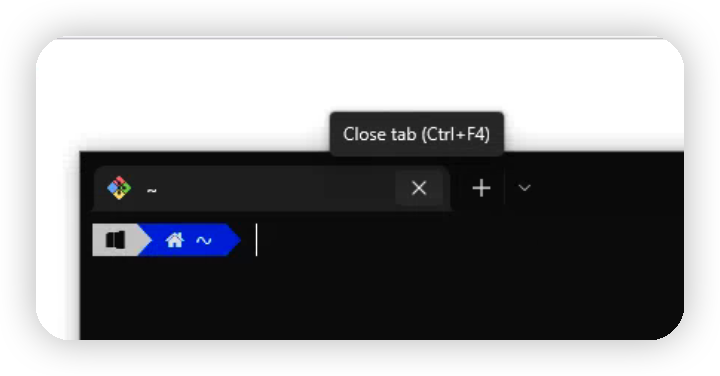
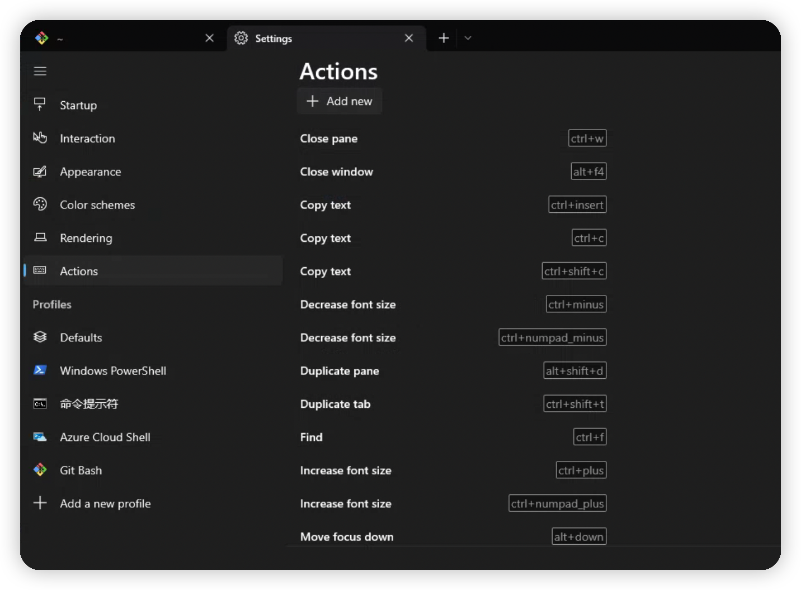

## 任务点

### 左右分屏

- cmd + d

### 上下分屏

- cmd + shift + d

### 切换分屏

- cmd + opt + 方向键
- cmd + [/]: 轮流切换

### 调整窗口

- cmd + ctrl + 方向键

### 新建标签页

- cmd + t

### 关闭标签页

- cmd + w: 会把标签页的分屏一并关闭

### 切换标签页

- cmd + 1/2/3...: 切换到第几个标签页
- cmd + 方向键

### 移动标签页

- cmd + shift + 方向键

## 社群讨论

[Windows Terminal 设置与 zsh 安装【非 WSL】 | Henry](https://tszv.vercel.app/pages/db656a/)

[iTerm2 用法与技巧 | Henry](https://tszv.vercel.app/pages/5ea06c/)

这个 windows 安装好使吗，好使的话 我记录到文档里面

我配置完看是好使的，感觉是最简单的可以支持 zsh 的了，为了这个还把公司电脑系统升级了一下

window terminal 确实好用

好用在哪？WT 分屏和关标签都没有默认快捷键，我的使用体验是它完全没往「键盘操作优于鼠标」这个方向去设计

这里有官方文档介绍：https://docs.microsoft.com/zh-cn/windows/terminal/panes

这个好用

官方文档还是很详细的，而且设置里也能找到吧

我就没搜到。因为我搜的是「close tab」，谁知道这个是「close pane」，而且很傻逼的是，你把鼠标放在标签的 x 上，它会显示快捷键是 Ctrl + F4。然后按了 Ctrl + F4 没有任何效果

那可以再试着搜一下 close，结果就出来了。我是安装完以后，把设置全部看了一遍

你好厉害。我是没耐性把设置看一遍再开始用的。看来有时确实得转变一下思路，先看说明书再用产品。

还有一个槽点是 WT 连个设置快捷键的 UI 界面都没有。我一看对快捷键这么不友好，就没什么动力找下去了

这个也有啊：

这。。不叫 shortcuts 也不叫 hotkeys，居然叫 actions

是，起名有点迷

很好。至少发现了我上手软件的流程跟你们不一样，有需要改进之处。
