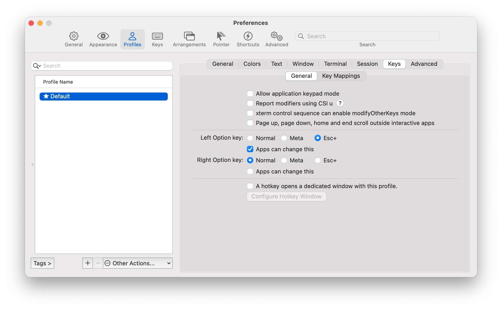
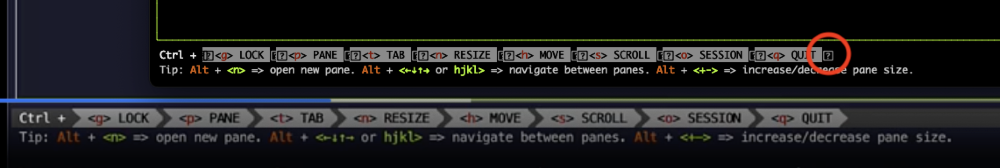
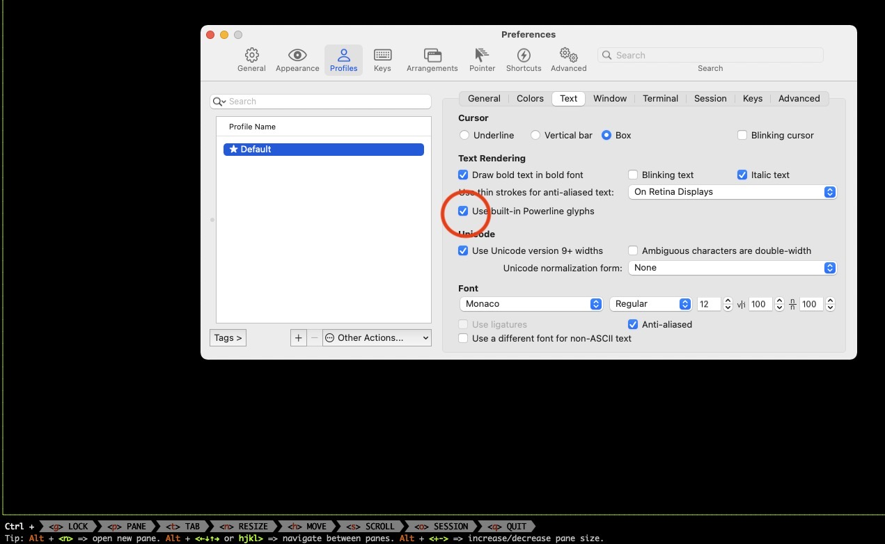
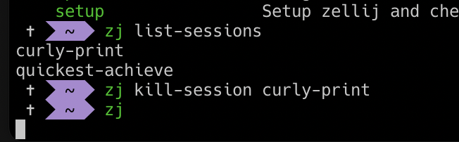

## 任务点

### 安装 zellij

- brew install zellij

关于 `brew` 可以看看这篇：[Mac 终端软件安装利器 - Homebrew | Henry](/pages/fe838b/)

### 配置别名

```zsh
echo "alias zj=zellij">>~/.zshrc
```

### 命令

在软件界面下面都可以找到

### 分屏

前置命令：`ctrl + p`

- 方向键：切换分屏
- p: 切换下一个分屏
- n: 新建分屏
- x: 关闭分屏
- d: 向下分屏
- r: 向右分屏
- f: 全屏/取消全屏
- w: 浮窗/关闭浮窗，会新建分屏
- e: 将当前分屏变为浮窗/将浮窗变为分屏，不会新建分屏
- c: 重命名分屏名称
- z: 以 iframe 形式展示，会隐藏名称

前置命令：`ctrl + n`

- 方向键/hjkl/+-：改变分屏大小

不需要前置命令：

- opt + n: 新建分屏
- opt + 方向键/hjkl: 切换分屏
- opt + +/-: 改变分屏大小

### 标签页

前置命令：`ctrl + t`

- 方向键：切换标签页
- n: 新建标签页
- x: 关闭标签页
- r: 重命名标签页

不需要前置命令：

- opt + hjkl: 切换标签页

## 社群讨论

文档的安装命令错了，应该是：brew install zellij

<hr />

alt + n 会变成一个字符这怎么改啊



<hr />

为什么我 opt + 左右方向键不能切换分屏，上下方向键可以，加 hjkl 也可以

按照上面那个截图，修改一下。

修改了，还不行

为什么我 zellij 切换 tab，opt + h 不生效啊，只有 L 生效，那个 opt 打出特殊字符的东西已经禁用了

你比我好点，我是 hl, 左右箭头都不生效，上下是好的。哦，我 hl 快捷键冲突了，但左右确实不好使

哦哦，你这样一说，我发现是跟我的  ishot 快捷键冲突了，你也可以检查一下 左右是不是哪里全局快捷键冲突了

我也有这个软件，那应该是了。好吧，不是这个，我还得找找别的原因

<hr />

为什么 zellij 从 brew 拉下来最新版是 0.14.0，我看了 homeBrew 官网上 zellij 的最新版是 0.30.0

brew 应该是没更新，更新下就行了：brew update

<hr />

我咋没有浮窗 w

你什么版本

是版本问题，我 brew 装的 15

<hr />

我这是缺了啥？



字体，nerd font，好像叫这个

找到你的终端去配置字体，没有的话就去下

https://stackoverflow.com/a/42353059，勾上这个可解，的确是字体



<hr />

感觉 zellij 绝大部分操作都需要按两次，有点繁琐

逻辑和 vspacecode 类似

<hr />

zj kill-session   后就要杀掉进程才能使用。



zj 就卡住了。

zj 从 0.29.1 升级到 0.30.0 解决了 kill-session 需要杀进程问题。

<hr />

VSCode 的 Cmd + W 突然关不了 tab 了，这是啥情况，这 VSCode 是被 WT 传染了吗

是不是覆盖了

是被盖了。但我不记得何时加的新 keybinding 了
