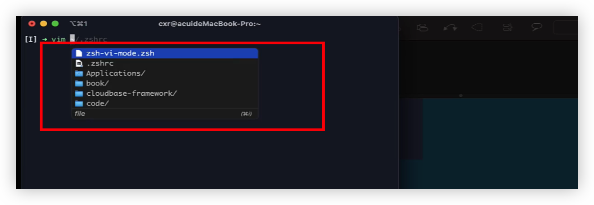
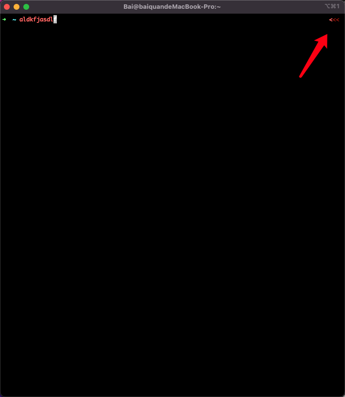
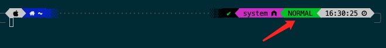
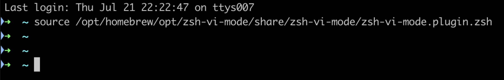
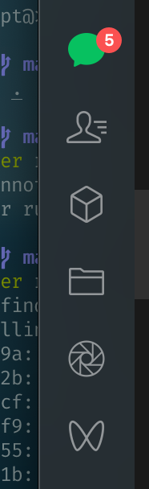

## 任务点

### 安装

第一种：As an Oh My Zsh! custom plugin

Clone zsh-vi-mode into your custom plugins repo

`git clone https://github.com/jeffreytse/zsh-vi-mode $ZSH_CUSTOM/plugins/zsh-vi-mode`

Then load as a plugin in your .zshrc

`plugins+=(zsh-vi-mode)`

Keep in mind that plugins need to be added before oh-my-zsh.sh is sourced.

第二种：Using Homebrew

For Homebrew users, you can install it through the following command

`brew install zsh-vi-mode`

Then source it in your .zshrc (or .bashrc)

`source $(brew --prefix)/opt/zsh-vi-mode/share/zsh-vi-mode/zsh-vi-mode.plugin.zsh`

### [自定义 esc](https://github.com/jeffreytse/zsh-vi-mode#custom-escape-key)

```
ZVM_VI_ESCAPE_BINDKEY: The vi escape key in all modes (default is ^[ => ESC)
ZVM_VI_INSERT_ESCAPE_BINDKEY: The vi escape key in insert mode (default is $ZVM_VI_ESCAPE_BINDKEY)
ZVM_VI_VISUAL_ESCAPE_BINDKEY: The vi escape key in visual mode (default is $ZVM_VI_ESCAPE_BINDKEY)
ZVM_VI_OPPEND_ESCAPE_BINDKEY: The vi escape key in operator pending mode (default is $ZVM_VI_ESCAPE_BINDKEY)
```

### 历史命令

iTerm 自带：

- ctrl + p/上方向键: 上一个
- ctrl + n/下方向键: 下一个

Oh My Zsh 自带：

- ctrl + r

zsh-vi-mode:

- j/k: 上/下
- /: 搜索
- n/N: 上/下

### 使用原生的 vim/vi

- vv

### 移动

参考 vim 命令

### 插入

参考 vim 命令

## 社群讨论

这个弹窗是什么插件啊



fig

<hr />

https://github.com/jeffreytse/zsh-vi-mode/issues/169

<hr />

我的进入 normal 模式下竟然是这样的，一开始以为没配置对



主题设置的问题，我的长这样



<hr />

装了 zsh-vi-mode 开了插件没有 `[I]` 怎么解决？



关了 重新打开 iTerm

关了重开也没有。是不是主题的原因？

主题的原因，这有没有倒也没关系啦 光标会变

<hr />

ctrl + p ctrl + n 不装插件也能用的，看到后面发现视频有说，ctrl + r zsh-vi-mode 官方 readme 里没提，查了一下发现是 zsh 提供的

<hr />

cmd + 12345，可以切换


