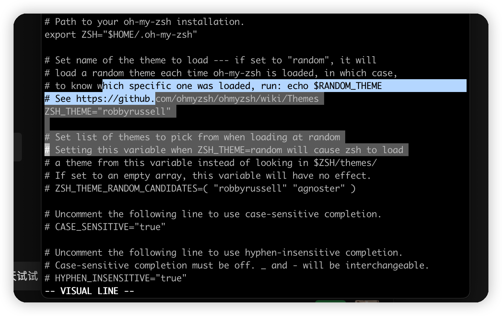
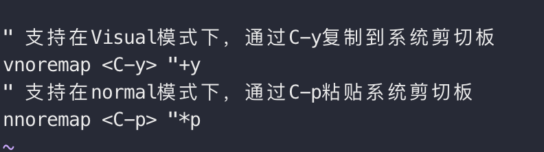
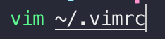

## 任务点

### surround

Classic:

- `S"` Add " for visual selection(和`ys"`比更推荐该方法)
- `ys"` Add " for visual selection
- `cs"'` Change " to ' 修改
- `ds"` Delete "

s-prefix:

- `sa"` Add " for visual selection
- `sd"` Delete "
- `sr"'` Change " to '

两种方式切换：如果想使用 s-prefix，则需要在 ~/.zshrc 中配置环境变量：`ZVM_VI_INSERT_SURROUND_BINDKEY=s-prefix`

### 改键

以 `^` 跳转到行首如何改成 `H`，`$` 跳转到行尾如何改成 `L` 为例：

如果我们是使用 brew 安装 zsh-vi-mode 的话，当时在 ~/.zshrc 中添加了一段 `source /opt/homebrew/opt/zsh-vi-mode/share/zsh-vi-mode/zsh-vi-mode.plugin.zsh`

所以我们先 `cd /opt/homebrew/opt/zsh-vi-mode/share/zsh-vi-mode/`

而如果当时我们是使用 As an Oh My Zsh! custom plugin 这种安装方式的话，当时我们是执行这个命令：`git clone https://github.com/jeffreytse/zsh-vi-mode $ZSH_CUSTOM/plugins/zsh-vi-mode` 把它下载到 zsh plugin 文件夹里了

所以我们先 `cd $ZSH_CUSTOM/plugins/zsh-vi-mode`

里面有 2 个文件：`zsh-vi-mode.plugin.zsh`(启动脚本) 和 `zsh-vi-mode.zsh`(配置脚本)

我们通过 `vim zsh-vi-mode.zsh` 进行下一步操作 (具体可以看 [插件文档](https://github.com/jeffreytse/zsh-vi-mode#custom-widgets-and-keybindings)

这是官方示例：

```zsh
# Your custom widget
function my_custom_widget() {
  echo 'Hello, ZSH!'
}

# The plugin will auto execute this zvm_after_lazy_keybindings function
function zvm_after_lazy_keybindings() {
  # Here we define the custom widget
  zvm_define_widget my_custom_widget

  # In normal mode, press Ctrl-E to invoke this widget
  zvm_bindkey vicmd '^E' my_custom_widget
}
```

我们可以依照这个实现`H`和`L`

```zsh
# 定义一个执行函数
function jump_end_of_line() {
  zvm_navigation_handler $
}
function jump_start_of_line() {
  zvm_navigation_handler ^
}

function zvm_after_lazy_keybindings() {
  # 当zsh-vi-mode加载时会声明该函数
  zvm_define_widget jump_end_of_line
  zvm_define_widget jump_start_of_line
  # 当监听到对应输入时调用自定义的函数(vicmd是normal模式下,visual是可视化模式下)
  zvm_bindkey vicmd 'L' jump_end_of_line
  zvm_bindkey vicmd 'H' jump_start_of_line
  zvm_bindkey visual 'L' jump_end_of_line
  zvm_bindkey visual 'H' jump_start_of_line
}
```

### 复制

该插件默认情况下是无法将内容复制到系统剪切板里的

在 `zsh-vi-mode.zsh` 中搜索 `zvm_vi_yank` 在里面添加一行 `echo ${CUTBUFFER} | pbcopy`

```zsh
function zvm_vi_yank() {
  zvm_vi_yank
  echo ${CUTBUFFER} | pbcopy
  zvm_exit_visual_mode
}
```

之后就可以通过 yy 或选中以后使用 y 复制内容，然后可以在系统其他地方粘贴

### setup

为了规范，我们可以不直接在 `~/.zshrc` 中修改环境变量，到 `zsh-vi-mode.zsh` 中搜索 `zvm_config` 在 config 函数中写环境变量就可以了。

例如：

```zsh
function zvm_config() {
  ZVM_LINE_INIT_MODE=$ZVM_MODE_INSERT
  ZVM_VI_INSERT_ESCAPE_BINDKEY=jk
}
```

### Increment and Decrement:

- `ctrl + a`
- `ctrl + x`

如果我们写了 `0` 通过 `ctrl + a` 0 便会递增 `ctrl + x` 会递减

如果我们写了 `true` 通过 `ctrl + a` 会变成 `false`

如果我们写了 `yes` 通过 `ctrl + a` 会变成 `no`

如果我们写了 `!=` 通过 `ctrl + a` 会变成 `==`

详情看[文档](https://github.com/jeffreytse/zsh-vi-mode#increment-and-decrement)

## 社群讨论

为啥我的 Surround 不好使？除了 S“、ys" 可用以外，其他的都用不了，比如 cs"' ，一按 c 就把选中的删除然后进入 insert 了

cs ds 不需要选中，也不能选中，就在需要修改或删除的地方用就可以

<hr />

为什么 zsh-vi-mode 找不到命令了，上午还好好的，brew install 也提示已安装

卸了 重装

新开一个标签页是可以用的，但是 source ~/.zshrc 之后 zsh-vi-mode 就失效了

<hr />

改键算是改源码吧，更新插件以后还在吗？

好问题 我还真没试过   明天试试

<hr />

好像在 vim 打开一个文件以后也不能复制，只能右键 copy

cmd c 可以吗

我的不行，和鼠标选中的不一样，一种蓝色的，一种灰色的



灰色的是 V 选中的不能 copy

确实不能复制





在这个文件里面配置一下就可以用 ctrl+y 来复制了

这个是 vimrc 的配置还是 zsh-vi-mode 的呢？

vimrc 的，太难了，我想 C-c 拷贝 C-v 粘贴

<hr />

看了这两天的两节课感觉，zsh vi mode 的用处 没有多大

你可以理解成增强   在 inert 模式   和平时一样   然后想操作的话 切换 normal   重点是操作上做到了统一

让 vim 无处不在，统一了操作习惯

主要是 surround 又有点残缺的样子，复制也有点小问题，能用 但有好像会膈应一下自己的感觉

感觉真没必要，terminal 就输入命令用的，真要编辑啥就进 vim 了

我也是这样觉得 我感觉命令行的自带快捷键基本够了 warp 有命令提示 有行首行尾快捷键 有按单词删除快捷键，再加上方向键 我感觉够用了
