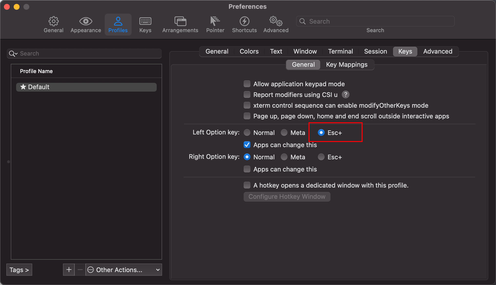

## 任务点

### widgets

- `zle -la`: 查看内置的 widgets
- `zle -N <widget name>`: 自定义 widgets

比如清空窗口：

```zsh
function clear_screen() {
  # do something
  zle clear-session
  # do something
}

zle -N clear_screen

bindkey '\eg' clear_screen
```

或者：

```zsh
bindkey '\eg' clear-screen
```

### bindkey

- `bindkey`: 可以查看所有的 widgets
- `bindkey <keystroke>`: 基于按键查看 widgets
- `bindkey <keystroke> <widget>`: 绑定到已经有的 widgets 里面
- `bindkey -s <keystroke> <keystroke>`: 把 a 绑定到 b 快捷键上
- `bindkey -M <keymap> <keystroke>`: 绑定到具体模式
- `bindkey -r <keystroke>`: 删除
- `bindkey -M <keymap> -r <keystroke>`: 删除

绑定的按键都是临时的，关闭 iTerm 之后就失效了

keystroke:

- ^: ctrl
- \e: opt

keymap:

- emacs: Emacs emulation
- viins: Vi mode - INSERT mode
- vicmd: Vi mode - NORMAL mode (also confusingly called COMMAND mode)
- viopp: Vi mode - OPERATOR-PENDING mode
- visual: Vi mode - VISUAL m

### 帮助手册

- man zshzle
- man-preview zshzle
- cat -v: 获取你输入的是什么字

## 社群讨论

option + 键盘会输出字符怎么解

为什么要解？你设置成快捷键 会优先触发快捷键的

我设了快捷键，他还是输出字符

那设置的有问题 你换成 cmd 试试会触发嘛

可以试下把 iterm2 这里的设置改一下



在 iterm2 的话 需要这么设置一下。上下文的重要性     说在 iterm2 中的话会很快定位到

<hr />

受 zvm 那个 bug 的影响，source zshrc 之后快捷键也会失效

有错误提示吗

没有任何错误提示

那这种 bug 最难找，现在是确定 zvm 这块插件造成的？

有人提过 issue，https://github.com/jeffreytse/zsh-vi-mode/issues/169
