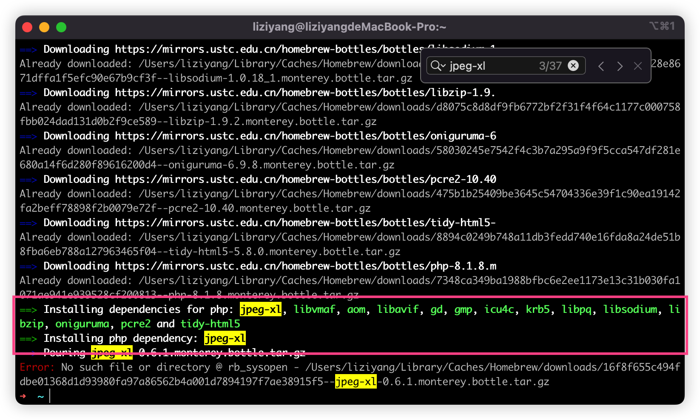
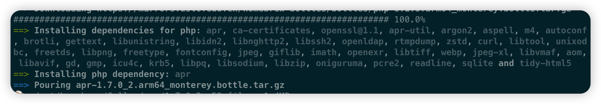

## 任务点

### 有道翻译

- [whyliam/whyliam.workflows.youdao: 使用有道翻译你想知道的单词和语句](https://github.com/whyliam/whyliam.workflows.youdao)
- keyword: yd
- 按回车 复制
- 按 Control ⌃+回车 打开有道翻译页面
- 按 Command ⌘+回车 直接在打出翻译结果
- 按 Shift ⇧+回车 直接发音
- 选中文字 双击 Option ⌥ 进行翻译（需要另行设置）
- yd \* 显示历史查询记录
- 按 Alt+回车，同步单词到有道在线单词本

- [wensonsmith/YoudaoTranslator: Alfred Youdao Translate Workflow](https://github.com/wensonsmith/YoudaoTranslator)

### github

- [gharlan/alfred-github-workflow: GitHub Workflow for Alfred 4](https://github.com/gharlan/alfred-github-workflow)

这个插件需要 php，mac 新系统不预装 php，需要自己下载

> This workflow requires PHP, which is no longer pre-installed since macOS 12 Montery.
> You can install it via Homebrew (brew install php).

下载过程中会报如下类似错误：

```
==> Installing php dependency: ca-certificates
==> Pouring ca-certificates-2022-04-26.all.bottle.tar.gz
Error: No such file or directory @ rb_sysopen - /Users/username/Library/Caches/Homebrew/downloads/66ab11fb867e9c78860f502908686ed6f07cb9ecdae61bdeab62941e7c8a499c--ca-certificates-2022-04-26.all.bottle.tar.gz
```

使用 brew install 对应的包即可：`brew install ca-certificates`

亲测需要手动下载 4、5 个

- gh user/repo
- gh @user
- gh s repo
- gh s @user
- gh my
- gh >

### newPath

- [vitorgalvao/alfred-workflows: Collection of Alfred workflows](https://github.com/vitorgalvao/alfred-workflows#newpath-)
- nf: create a new file
- nfo: create and open a new file
- nd: create a new directory
- ndo: create and open a new directory

### vscode

- [alexchantastic/alfred-open-with-vscode-workflow: Alfred 5 workflow for opening files or folders in Visual Studio Code.](https://github.com/alexchantastic/alfred-open-with-vscode-workflow)
- code: open the current folder or the selected file
- codef: search and open

### emoji

- [carlosgaldino/alfred-emoji-workflow: Alfred 2 workflow for searching emoji codes.](https://github.com/carlosgaldino/alfred-emoji-workflow)
- emoji
- [jsumners/alfred-emoji: Alfred workflow for searching and copying emoji](https://github.com/jsumners/alfred-emoji)

### 直接搜索给出结果的插件

- google: 在 workflow 界面左下角点击 +，在 Examples 中找到 Google suggest
- StackOverflow: https://github.com/zenorocha/alfred-workflows#stack-overflow-v101--download
- Package Managers: https://github.com/willfarrell/alfred-pkgman-workflow

### iTerm <-> Finder

- [LeEnno/alfred-terminalfinder: Alfred workflow to open current Finder window in Terminal/iTerm and vice versa.](https://github.com/LeEnno/alfred-terminalfinder)
- ft: open current Finder directory in Terminal
- tf: open current Terminal directory in Finder
- fi: open current Finder directory in iTerm
- if: open current iTerm directory in Finder

### 生成变量名

- [xudaolong/CodeVar: 生成可用的代码变量 (CodeVar that return u a better variable from Chinese to English . )](https://github.com/xudaolong/CodeVar)
- 小驼峰命名法:xt
- 大驼峰命名法:dt
- 下划线命名法:xh
- 常量命名法:cl
- 中划线命名法:zh

### 更多的 workflows

- [Share your Workflows - Alfred App Community Forum](https://www.alfredforum.com/forum/3-share-your-workflows/)
- [learn-anything/alfred-workflows: Amazing Alfred Workflows](https://github.com/learn-anything/alfred-workflows)
- [Alfred Workflows - Extend Alfred and Boost Your Productivity](https://www.alfredapp.com/workflows/)
- [zenorocha/alfred-workflows: A collection of Alfred 3 and 4 workflows that will rock your world](https://github.com/zenorocha/alfred-workflows)

## 社群讨论

兄弟们你们装 php 要安这么多库吗



是的，报了好多这种错误

```
==> Installing php dependency: ca-certificates
==> Pouring ca-certificates-2022-04-26.all.bottle.tar.gz
Error: No such file or directory @ rb_sysopen - /Users/username/Library/Caches/Homebrew/downloads/66ab11fb867e9c78860f502908686ed6f07cb9ecdae61bdeab62941e7c8a499c--ca-certificates-2022-04-26.all.bottle.tar.gz
```

`brew install ca-certificates`

差一点我都快不想安了

一次性把所有的都安上就行



我这个比你那个还多呢

这一大段复制，把 and 和 , 删掉，直接一把安装，可能有更好的办法，但是我不知道

反正我是哪里报错哪里再安装

php 这么难安装啊

是挺难装的
