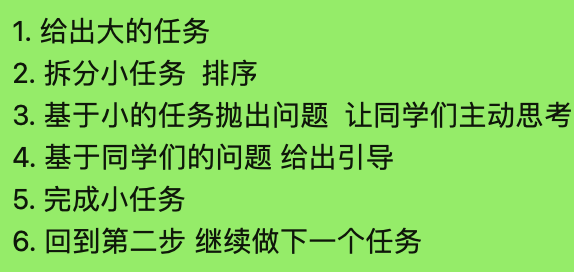
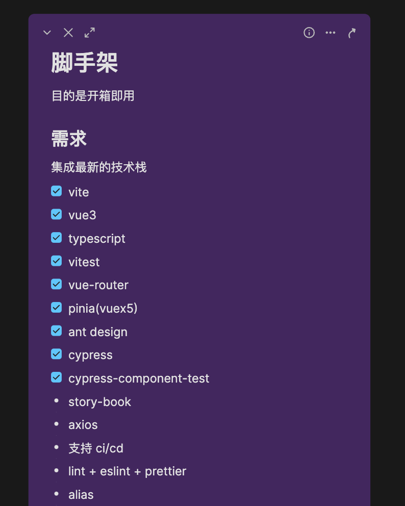

## 任务点

### 移动光标到行首

- cmd + left
- ctrl + a

### 移动光标到行尾

- cmd + right
- ctrl + e

### 向左移动一个单词

- opt + left

### 向右移动一个单词

- opt + right

### 删除一个单词

- opt + delete

### 基于光标向右删除

- ctrl + d

### 选中到行首

- shift + up
- shift + cmd + left

### 选中到行尾

- shift + down
- shift + cmd + right

### 向左选中

- shift + left

### 向右选中

- shift + right

### 向左选中一个单词

- shift + opt + left

### 向右选中一个单词

- shift + opt + right

### 移动到上一行

- ctrl + p

### 移动到下一行

- ctrl + n

### 光标左移动

- ctrl + b

### 光标右移动

- ctrl + f

## 社群讨论

最近真的在策划一个新的，探索如何主动学习   的教学形式

这个真的是授人以渔

因为传统的教学形式 比如大家看视频 看文章的形式，吸收并不好 而且不能很好的促进大家主动思考，不主动思考的话   就不太能感受到学习的快乐

是的 我觉得主动看书比看视频要快乐

不能死读书   还是要灵活的让自己能去思考，才能发现问题   然后解决问题

这是刚刚讨论的教学模型

这不是敏捷吗？

核心是 tasking   任务拆分

回头拿这个 做个尝试，给出问题 引导 + 讨论   驱动你主动完成这个大任务

shift + up 应该是选中到上一行行尾，option + delete 应该是向左删除到单词首

shift + up/down 有点奇怪 我都不知道怎么描述它的行为了

不同的应用表现不是太一样，弃用

应该是选中到光标上一行的相同位置

按下 shift 相当于按下了鼠标，down 就相当于光标往下移了一格。如果只有一行就相当于选到行尾了。
