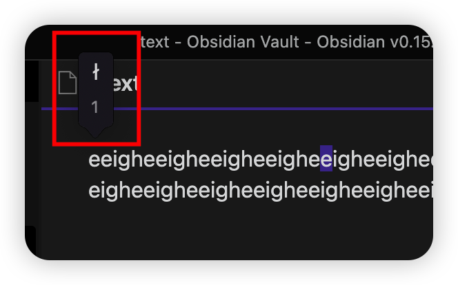
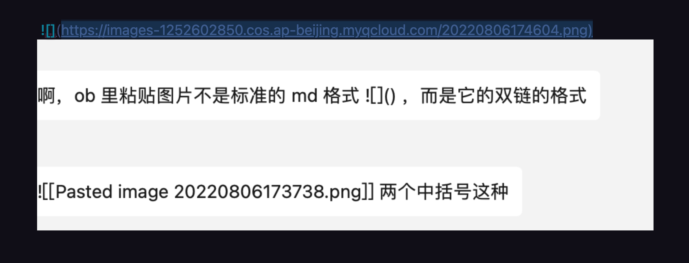
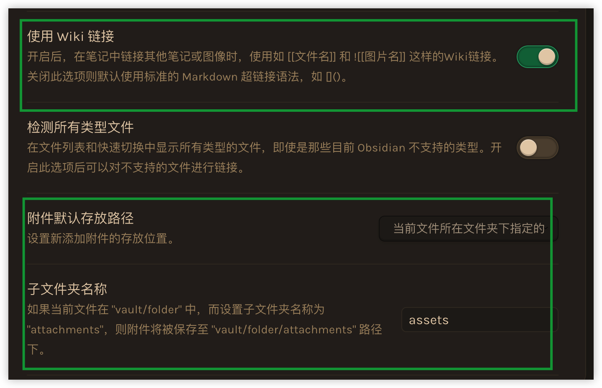
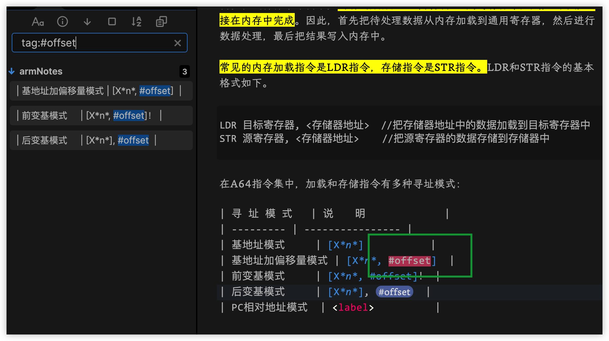

## 任务点

### 打开 vim

`cmd + ,` 打开设置，在 `Editor` 中打开 vim 开关

### 下载 vim 插件

`cmd + ,` 打开设置，在 `Community plugins` 点击 `Browse` 搜索 `Vimrc Support` 并安装，安装以后点击 `enable` 启用插件

[esm7/obsidian-vimrc-support: A plugin for the Obsidian.md note-taking software](https://github.com/esm7/obsidian-vimrc-support)

### 配置 vim 插件

在当前根目录创建配置文件：`vim .obsidian.vimrc`

### 按键映射

例子：`map H 0`

mode-specific:

- map: normal,visual,operator pending modes
- map!: insert
- nmap: normal
- imap: insert
- vmap: visual
- omap: operator pending

non-recursive:

- noremap: normal,visual,select and operator pending modes
- noremap!: insert
- nnoremap: normal
- inoremap: insert
- vnoremap: visual
- onoremap: operator pending

### 复制到系统剪切板

`set clipboard=unnamed`

### 通过 vim 执行 obsidian 的命令

例子：

```vim
exmap back obcommand app:go-back
nmap <C-o> :back
exmap forward obcommand app:go-forward
nmap <C-i> :forward
```

自定义命名的时候只支持驼峰命名

查看所有的 ob 命令：输入 `:obcommand`，通过快捷键 `opt + cmd + i` 打开控制台，看 console.log

### 使用 \<Space\> 来定义命令

首先需要解绑 Space: `unmap <Space>`，然后就可以绑定了

### 添加双链

```vim
exmap wiki surround [[ ]]
map [[ :wiki
```

选中文字，键入 `[[` 即可创建双链，使用 `opt + enter` 即可编辑该双链

## 社群讨论

```vim
" Have j and k navigate visual lines rather than logical ones
nmap j gj
nmap k gk
```

这个挺好的，换行以后，使用 jk 移动的时候，换行的那一行是按多行算的

多行的时候 是挺好用

我记得 vscode 没有用 vim 之前就是这样的，使用 vim 后还老不习惯了，现在加上后又和以前一样了

<hr />

快速移动的时候出现这个了，是不是还需要和 vscode 一样配置一下？



[macos 下 obsidian vim 模式 长按 j，无法连续向下 - SegmentFault 思否](https://segmentfault.com/a/1190000041062982)

defaults write md.obsidian ApplePressAndHoldEnabled -bool false

这样设置一下就好了

<hr />

normal 模式切换到中文输入法居然可以正常插入

Ob 里面的 vim 只能说是可以用

<hr />

啊，ob 里粘贴图片不是标准的 md 格式 `` ，而是它的双链的格式，`![[Pasted image 20220806173738.png]]` 两个中括号这种

我这里是可以的



啊，这个我好像不是这样，我再看看，你这个是网络图片，我是指本地剪贴板直接粘贴上的图片



相关的设置是这两项，但是这个 wiki 链接是它的核心功能吧，发现关掉这个也不影响 [[ 调出别的笔记

`![[]]` 这个语法是嵌入   也是可以嵌入图片的

懂了，可是这样普通的 md 软件就不能识别这个语法了，Typora 识别不了

你依然可以使用 `` 呀

我的意思是，如果直接从剪贴板粘贴，需要关掉那个 wiki 选项，ob 才默认使用 `` 语法，它支持这个语法，但是我不想手动与输入 ``

关掉 wiki 双链残废了，那还是手动 `` 吧

用这个插件 https://github.com/renmu123/obsidian-image-auto-upload-plugin 可以直接截图 他就给你处理好了   基于 picgo 生成图片链接

主要我图片是保存在本地相对路径里的

<hr />

发现 `#word` 就会被认作是标签


